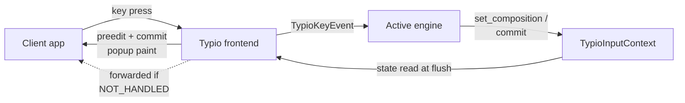
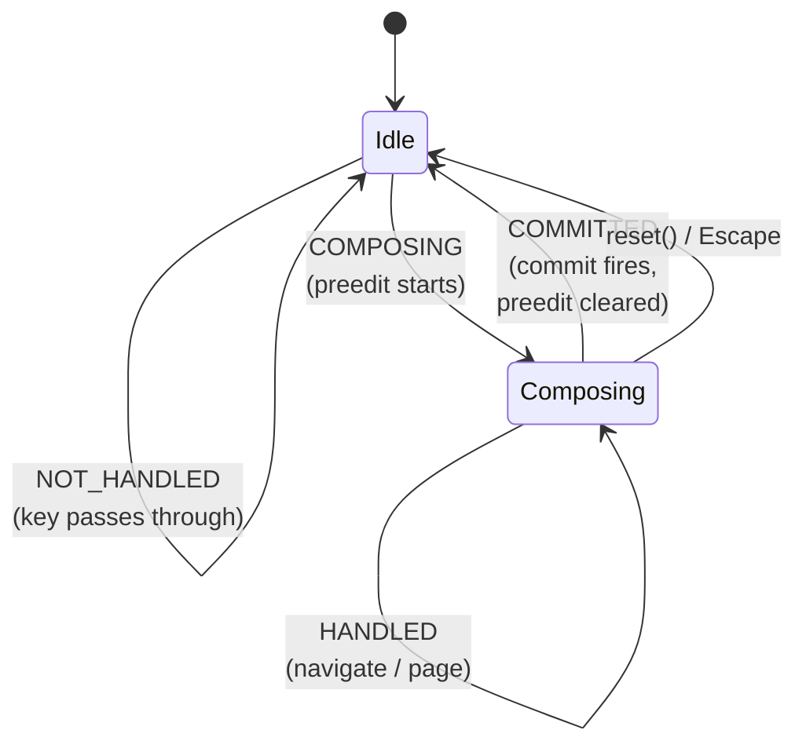
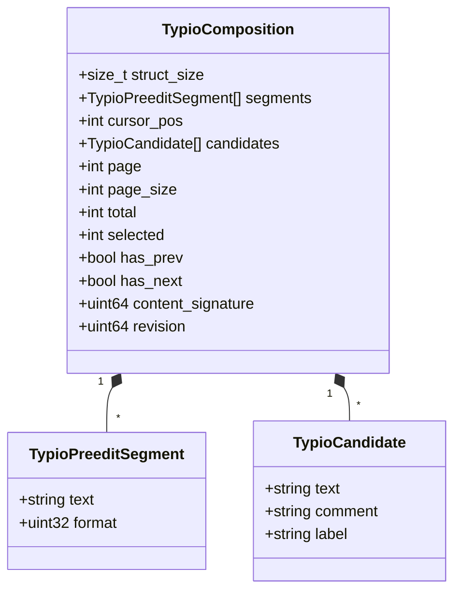
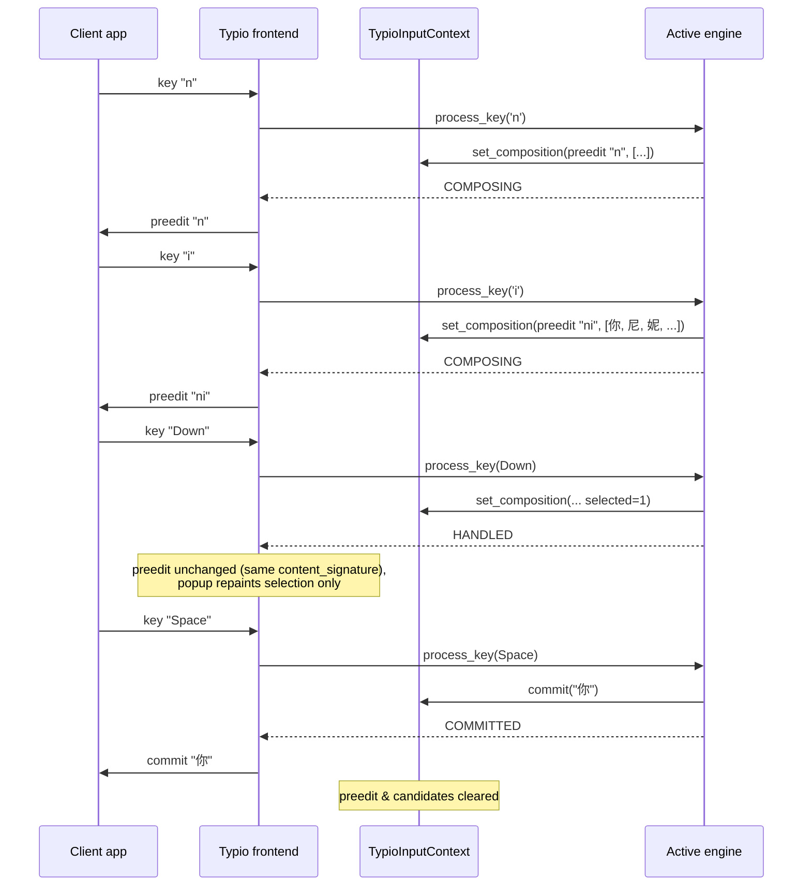
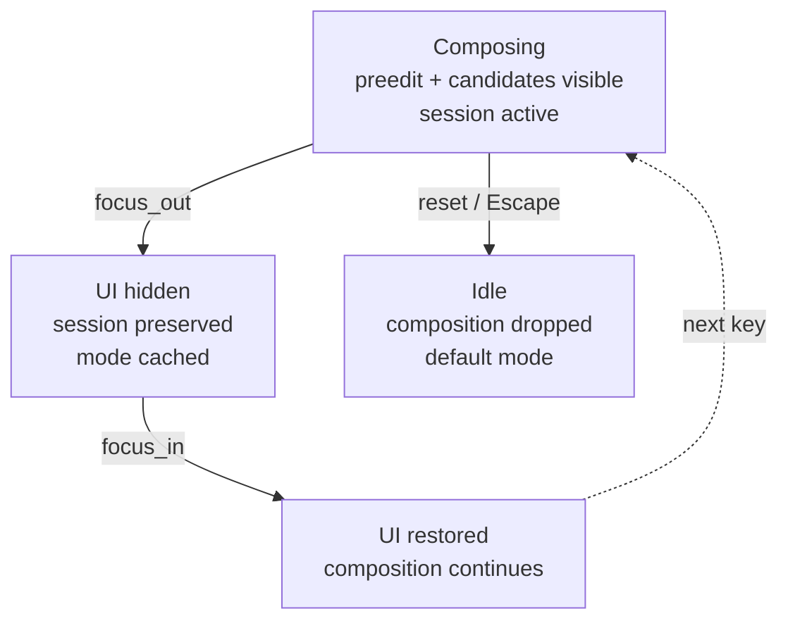

# Composition State Machine

How a keystroke becomes committed text — the abstract typing pipeline and its state machine, independent of the Wayland protocol and any specific engine.

For the architectural boundary between engine and framework see [Engine Contract](engine-contract.md); for a concrete real-world engine see the `typio-engine-rime` repository's `docs/explanation/librime-integration.md`.

> The composition ABI on this page reflects [ADR-0006](../adr/0006-composition-state-and-commit-event.md): preedit and candidates are one transactional **composition** value, and commit is a separate ordered **event**.

## Actors

- **`TypioInputContext`** — per-focus state carrier. Holds the current preedit, the current candidate list, and per-context properties (engine sessions, mode caches). The context outlives focus churn; only its visible UI is cleared on focus loss.
- **Active engine** — the language logic. Receives key events, decides what to do, and emits a composition and commits through the context.
- **Typio frontend** — translates context updates into protocol output (preedit and commit requests to the client; popup repaint for candidates) and forwards untouched keys back to the client.

The engine is *the only* author of composition state. Typio never invents preedit text or re-orders candidates.

The solid arrows are the composition path; the dashed arrow is the passthrough path for keys the engine declines.

## The Four Key Outcomes

Every key delivered to the active engine via `process_key` returns one of four values (`include/typio/types.h`):

| Result | Meaning | Engine emits | Frontend reaction |
|---|---|---|---|
| `TYPIO_KEY_NOT_HANDLED` | Engine did not consume the key | nothing | forward the original key press/release to the client |
| `TYPIO_KEY_HANDLED` | Engine consumed it, but no committed text and no composition delta (e.g. candidate navigation, mode toggle) | possibly updated candidates / mode | swallow the key; repaint popup if state changed |
| `TYPIO_KEY_COMPOSING` | Engine consumed it and updated the in-flight composition | new preedit and/or candidates | swallow the key; refresh preedit + popup |
| `TYPIO_KEY_COMMITTED` | Engine consumed it and produced final text | committed text via `typio_input_context_commit`; preedit cleared | swallow the key; send commit; clear popup |

`HANDLED` vs `COMPOSING` is the navigation-vs-edit split: highlighting a different candidate is `HANDLED` (selection moved, preedit text is unchanged), while typing another letter that extends the syllable being composed is `COMPOSING`.

`COMMITTED` from the `Idle` state is also legal — printable keys in the `compose` engine commit directly without ever entering `Composing`.

## State Shapes

Composition is **one value**, not two. Preedit and candidates are the same concept — the in-flight composition — so they live in a single `TypioComposition` the engine emits transactionally. The context is never half-updated, and the two can never disagree.

**Composition** (`TypioComposition`) — the entire in-flight state, emitted with `typio_input_context_set_composition(ctx, &comp)`. An *empty* composition (no segments, no candidates) is the `Idle` state; there is no separate clear call and no kind flag — emptiness *is* cleared.

Its two parts:

- **Preedit** — the uncommitted text shown inline at the cursor. An ordered array of `TypioPreeditSegment { text, format }` (format flags `UNDERLINE / HIGHLIGHT / BOLD / ITALIC`, combinable) plus a `cursor_pos` in Unicode scalar values, used by the client to draw the caret inside the preedit.
- **Candidates** — the popup contents. An array of `TypioCandidate { text, comment, label }` plus `page`, `page_size`, `total`, `selected`, `has_prev`, `has_next`, and a `content_signature` that excludes the selected index. The `content_signature` lets the popup classify selection-only updates separately from content changes — see [Architecture Overview §Delta classification](architecture-overview.md#delta-classification). Moving the selection is therefore a normal composition update where only `selected` (and `revision`) change.

Commits are **not** state; they are a one-shot **event** on a separate ordered channel. `typio_input_context_commit(ctx, text)` hands a finalized UTF-8 string to the frontend, which forwards it to the client. Commit is deliberately not a variant of `TypioComposition`: a single keystroke may both commit finalized text *and* leave a residual composition (e.g. Rime commits a completed phrase while keeping trailing pinyin), which two channels represent and a terminal commit-state cannot.

## A Typical Composition

The shape is the same for any keyboard engine: one or more `COMPOSING` steps that grow the preedit and candidate set, zero or more `HANDLED` steps that move selection or change pages, and a terminating `COMMITTED` step (or an `Escape` that resets without committing).

## Why Coalescing Matters

The engine may emit `set_composition` on every keystroke. The frontend does **not** repaint per emission — the composition callback sets a `popup_update_pending` flag and the actual render happens once per event-loop iteration, diffing against the last composition sent. Auto-repeat bursts collapse into a single popup paint, and selection-only updates (same `content_signature`) skip the application-side preedit round-trip entirely. Commit rides a separate channel and is applied in order relative to composition updates, so "commit then start a new composition" stays correctly sequenced.

This is what lets engines treat sync as straightforward: rebuild the full composition each time, return `COMPOSING` / `HANDLED`, and let the coalescing layer downstream drop the redundant work.

## Focus, Reset, and Sessions

Three lifecycle hooks change composition state without a key:

- **`focus_in`** — the input context just became focused. The engine should restore any visible UI that `focus_out` hid (re-emit the composition).
- **`focus_out`** — the input context lost focus. The engine should clear *visible* UI but keep *session* state — runtime options like `ascii_mode`, the librime session id, half-typed pinyin — so the next `focus_in` resumes seamlessly.
- **`reset`** — the user asked for a hard cancel (typically `Escape` with an active composition). The engine should drop the composition and return to its idle mode.

The distinction is deliberate: focus churn is constant during normal use (window switching, popups, menus) and must not lose the user's in-flight syllable. Only explicit `reset` or commit ends a composition.

Focus loss is reversible; `reset` is not.

Engines store per-context session state via `typio_input_context_set_property` / `_get_property`. The property is keyed by engine name and survives focus loss because the `TypioInputContext` itself outlives focus — the engine reuses the same session across `focus_out` → `focus_in` round-trips.

Focus churn is only the *announced* way composition state changes. System suspend, compositor restarts, and silent grab loss change the real state without any protocol event — recovery from those is the host's responsibility, not the framework's.

## Authority Split Inside the State Machine

Within this state machine the split is:

- **Engine owns** — what the preedit reads, which candidates exist, what ordering they have, which one is selected, when a commit fires, and what its text is.
- **Typio owns** — when the popup paints, how candidates are laid out, how preedit is delivered to the client, and how `NOT_HANDLED` keys are forwarded.

An engine that wants different candidate ordering edits its own logic; it never asks Typio to reorder. Typio that wants smoother painting edits the popup pipeline; it never rewrites engine output.

This section describes who decides what *while the state machine is running*. For the architectural rationale behind this split — why the boundary is drawn here and how it generalises across languages — see [Engine Contract](engine-contract.md#4-the-abstraction-layer-what-the-framework-knows-vs-what-it-does-not).

## Example: `compose` vs. Rime

The `compose` engine (`typio-engine-compose/src/main.rs`) only ever returns
`NOT_HANDLED` or `COMMITTED`: printable Unicode keys are committed directly
with no preedit and no candidates. It is a minimum useful keyboard engine
and a reference for what *not* using composition looks like.

The `librime` plugin uses every stage — preedit, multi-page candidates, mode switching, deferred deployment. The `typio-engine-rime` repository's `docs/explanation/librime-integration.md` (§5.2 Processing Flow) shows the concrete steps an engine performs inside a single `process_key`.

## See Also

- [Engine Contract](engine-contract.md) — the architectural boundary between engine and framework: why this split exists and how it works for Rime, Mozc, and voice
- [Architecture Overview](architecture-overview.md) — components and protocol stack
- [Engine Operations](../reference/engine/ops.md) — full signatures for `TypioEngineBaseOps`, `TypioKeyboardEngineOps`
- [Input Context](../reference/host-abi/input-context.md) — input-context emit functions
- [How to Create a Custom Keyboard Engine](../how-to/create-custom-keyboard-engine.md) — applying this state machine in a new keyboard plugin
