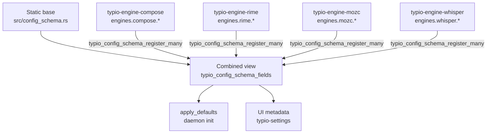

# Configuration System

## Design Goal

Every configuration field — type, default, UI metadata — is described by exactly one `TypioConfigField` record, regardless of who owns it. The daemon, control surfaces, and user documentation derive their behaviour from the schema rather than maintaining parallel field lists.

Ownership of those records is split: libtypio holds a **static base** for keys
that are host-wide, and each engine contributes its own `engines.<name>.*`
records during worker initialization. No engine-specific key is built in;
every engine ships as a separate worker package.

## Two-Layer Schema



Lookup, default application, and field enumeration see both layers transparently. Adding a new host-level field means appending one entry to the static base; adding a new engine field means the engine declares the field and either exports `typio_engine_get_config_schema` for the host loader to register, or calls `typio_config_schema_register_many` from its own `init`. Core never has to know which knobs an engine exposes.

Why dynamic registration matters: it lets the framework keep its own surface narrow ("display things and route key events") while letting engines evolve their own configuration independently of libtypio releases. Adding a new option to Rime no longer requires a libtypio change. See the [Schema reference](../reference/host-abi/schema.md) for the exact ABI.

### Order of operations

1. Host loader `dlopen`s each engine plugin.
2. Host calls `typio_engine_get_info` and (if exported) `typio_engine_get_config_schema`, forwarding the schema to `typio_config_schema_register_many`.
3. `typio_instance_init` loads `core.toml` and calls `typio_config_apply_defaults`, which sees both layers in one pass.
4. UI consumers and D-Bus introspection use `typio_config_schema_fields` to enumerate the combined view.

The "exported function before instantiation" order is what makes engine config visible to settings UIs before the engine itself is activated. An engine that registers from `init` instead won't show its keys until first activation; both are supported, the export form is preferred.

### Unknown keys

A `core.toml` may legitimately contain `engines.foo.*` keys whose plugin is not currently installed. Those keys are preserved by the TOML store on read and round-trip on write, so swapping the engine back in restores the user's settings. No layer treats an unrecognised `engines.*` key as an error.

## Configuration Lifecycle

### 1. Load

`typio_instance_init` reads `core.toml` from the config directory:

```text
load_file(path)  ->  TypioConfig (flat key-value store)
```

The parser handles a TOML-compatible subset: top-level keys, `[section]` headers, and `key = value` pairs. Dotted keys are built by joining `section.key`.

**Known parser limitations:**

- No nested tables (`[a.b.c]` works; inline `{...}` does not)
- No array-of-tables (`[[array]]`)
- No multiline strings
- No inline arrays (TOML `[1, 2, 3]`)

These are sufficient for Typio's flat configuration model.

### 2. Apply Defaults

`typio_config_apply_defaults` iterates the schema table and sets any missing key to the field's default value. Existing user values are never overwritten.

Defaults are applied after initial load, after `ReloadConfig()`, and after a valid `SetConfigText(s)` replacement has been parsed. Empty `SetConfigText` content is rejected before defaults are applied so an accidental blank write cannot silently become a full default config.

After this step the daemon holds a complete config with no missing defaults.

### 3. Hold

`TypioInstance` owns the live `TypioConfig *`. All daemon subsystems read from it. Engine-specific sections are extracted via `typio_instance_get_engine_config(instance, "rime")`, which returns a copied sub-config.

### 4. Expose Over D-Bus

The D-Bus service, path, and interface constants are owned by the host that
exposes the bus (`typio` for the reference host); libtypio does not
publish them.

The status bus exposes two config-related properties:

- **`ConfigText`** — the full config serialised to text (`typio_instance_get_config_text`)
- **`ActiveEngineState`** — includes engine-specific config entries prefixed with `config.*`

And two config-mutating methods:

- **`SetConfigText(s)`** — parse -> defaults -> save -> reload
- **`ReloadConfig()`** — re-read file from disk -> defaults -> switch engine if needed -> notify callback

Both emit `PropertiesChanged` after completing.

### 5. Edit From Control Surfaces

Control surfaces follow the instant-apply model documented in the `typio-settings` repository's `docs/explanation/control-surfaces.md`:

1. Read `ConfigText` from the daemon
2. Seed a local stage
3. Let the user edit
4. Submit the full staged config via `SetConfigText`

Control surfaces never write `core.toml` directly.

### 6. Reload

`typio_instance_reload_config` (called by `SetConfigText`, `ReloadConfig`, or the debounced config-watch timer) replaces the in-memory config, re-runs defaults, switches the active engine if the state file changed, tells the active engine to `reload_config`, and fires the `config_reloaded_callback`. The Wayland frontend registers this callback to refresh shortcuts, voice, and the status bus.

Inotify events do not reload config directly. `wl_runtime_config.c` schedules a short debounce timer so common editor save patterns (`write`, `rename`, `chmod`, multiple close events) collapse into one reload. If the watched file is deleted, moved, or atomically replaced, the watcher is rearmed before the reload is scheduled.

The callback boundary means Typio accepted the new config and refreshed the runtime pipeline. It does not require every optional subsystem to finish heavy work synchronously. In particular, voice backends may continue loading a replacement model on a background thread after `reload_config` returns.

### 7. Explicit Rime Deploy

`typio_instance_deploy_rime_config` is the manual rebuild path for out-of-band Rime edits under `user_data_dir`, such as `default.custom.yaml`. Unlike normal config reload, this path forces librime maintenance and invalidates generated `build/*.yaml` artifacts first so rapid successive edits still rebuild even if filesystem timestamps land in the same second.

After deployment completes, the engine increments an internal `deploy_id`. All existing Rime sessions track the `deploy_id` at the time of their creation. On the next interaction, the engine detects the mismatch, transparently destroys the stale librime session, and recreates it using the newly compiled Rime data. This ensures that changes take effect immediately in all open applications without requiring a Typio restart.

## Schema Table Structure

`TypioConfigField` shape and per-field semantics are documented in the
[Schema reference](../reference/host-abi/schema.md#typioconfigfield). Two
points worth understanding at the design level:

- Fields without `ui_label` are internal (no UI representation).
- Fields with `runtime_property` are still persisted config keys, but the
  metadata signals that the key has a direct daemon runtime mirror; control
  surfaces should prefer that runtime property for display state when
  appropriate. See [Config & Runtime Ownership](config-runtime-ownership.md).

## How To Add A New Configuration Field

For a **host-level** key (anything outside `engines.<name>.*`):

1. Add one `TypioConfigField` entry to the `SCHEMA` table in `src/config_schema.rs`.
2. If it should appear in `typio-settings`, set the `ui_*` fields.
3. Update [Configuration Reference](../reference/configuration.md).

For an **engine-level** key:

1. Add the `TypioConfigField` entry to your engine.s static schema table.
2. Either export it via `typio_engine_get_config_schema` or register it in your `init` with `typio_config_schema_register_many`.
3. Update the engine's own user-facing docs (and the relevant row in [Engine Reference](../reference/engines.md) if upstream).
4. No libtypio change is needed.

Either way the field is automatically parsed, defaulted, serialised, and exposed over D-Bus.

## Invariants

- The daemon is the only writer of `core.toml`.
- `ConfigText` round-trips: `load_string(to_string(config))` produces an equivalent config.
- `apply_defaults` never overwrites a user-set value.
- All daemon-owned config entry points apply schema defaults before publishing the config to runtime subsystems.
- Config watch reloads are debounced and must be safe across atomic file replacement.
- Control surfaces must not write config state before receiving the first `ConfigText` from the daemon (see the known failure pattern in the `typio-settings` repository's `docs/explanation/control-surfaces.md`).
