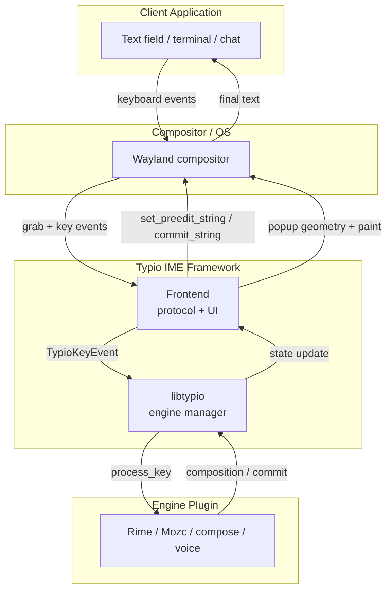
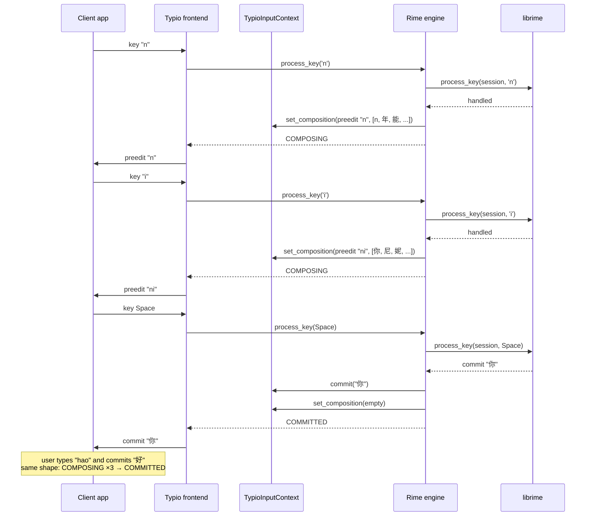
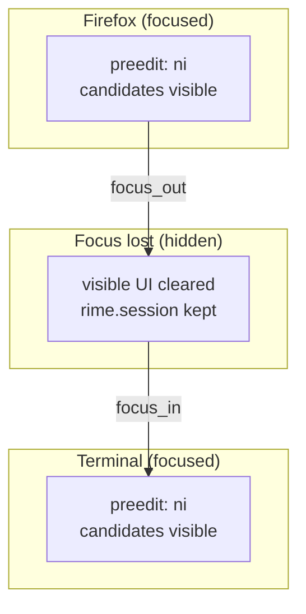

# Engine Contract: The Boundary Between Framework and Input Engine

This document explains *why* Typio's input-engine architecture looks the way it does, walking through a concrete Rime example and showing how the same abstraction supports Korean, Japanese, Vietnamese, emoji, and voice input without the framework knowing anything about their internals.

For the protocol-side translation see [Architecture Overview](architecture-overview.md); for the composition state-machine see [Composition State Machine](composition-state-machine.md); for Rime's internal API calls see the `typio-engine-rime` repository's `docs/explanation/librime-integration.md`.

## 1. What an IME Actually Does

An Input Method Editor (IME) is a contract between three parties:

- **The client application** — a text field in Firefox, a terminal, a chat window.
- **The operating system / compositor** — routes keyboard events, positions popups, delivers preedit and commit strings.
- **The engine** — the language logic that turns raw keycodes into characters.



> **Grab** (keyboard grab): a Wayland protocol object (`zwp_input_method_keyboard_grab_v2`) that gives the IME exclusive access to raw key events while active. Without it, keys would go straight to the client and Typio could not intercept them. For a full definition see the [Glossary](../reference/glossary.md#g).

The engine is where the complexity lives. Chinese pinyin needs syllable segmentation, tone-aware ranking, and a user dictionary. Japanese needs okurigana handling and kana-to-kanji conversion. Korean needs jamo composition into hangul syllables. Vietnamese needs diacritic stacking. Emoji needs fuzzy search. Voice needs VAD, ASR, and punctuation insertion.

Typio's design question was: **can one framework host all of these without baking any language knowledge into its core?**

The answer is a deliberately thin boundary — three data structures and two vtables — that lets each engine be as complex as it needs while the framework worries about timing, coalescing, protocol translation, and UI placement.

## 2. A Walkthrough: Typing "你好" with Rime

The best way to understand the abstraction is to follow one real keystroke sequence through every layer.

### 2.1 Setup: Who Owns What Before Any Key Is Pressed

Before the user types, the following state already exists:

- **The Linux host** (`typio`) has bound `zwp_input_method_v2`, created
  the candidate UI surface, and loaded an XKB keymap.
- **The engine manager** (`libtypio`) has activated the Rime process backend; the
  host has started `typio-engine-rime`, and the engine process has initialized librime.
- **A `TypioInputContext`** has been created. It is empty — no preedit, no candidates — but it already has space for engine-specific properties.

None of these layers know that the user is about to type Chinese. The framework does not know pinyin exists.

### 2.2 Step 1: "n"

The user presses the `n` key.

1. **Compositor → Frontend**. Wayland delivers a `wl_keyboard.key` event. The frontend's XKB state translates scancode 38 into keysym `XK_n`, modifier mask 0, and Unicode codepoint `U+006E`.
2. **Frontend → Engine**. The frontend builds a `TypioKeyEvent`:
   ```c
   { .type = KEY_PRESS, .keysym = XK_n, .unicode = 'n', .modifiers = 0 }
   ```
   and calls the active engine's `process_key`.
3. **Inside Rime**. `typio_rime_process_key()` translates the `TypioKeyEvent` into librime's mask format, looks up the session stored as a property on the `TypioInputContext`, and calls `api->process_key(session_id, keysym, mask)`.
4. **librime's internal work**. librime sees `n` in the current schema (e.g., 朙月拼音). It appends it to the composition buffer, runs the segmentor, queries the dictionary, and produces a candidate list ranked by frequency and user history. No text is committed yet.
5. **Engine → Context**. `typio_rime_sync_context()` pulls the new `RimeContext` and emits one composition:
   - `typio_input_context_set_composition(ctx, { preedit "n", candidates ["n", "年", "能", ...] })`
6. **Return value**. `process_key` returns `TYPIO_KEY_COMPOSING`.
7. **Frontend reaction**. The frontend swallows the key (does not forward it to the client). It notes the composition changed. The actual UI update is deferred to the next event-loop flush.
8. **At flush time**. The frontend sends `zwp_input_method_v2.set_preedit_string("n")` to the client and repaints the popup with the candidate list.

The client now shows `n` underlined at the cursor, and a popup shows candidates.

### 2.3 Step 2: "i"

The user presses `i`.

The same pipeline runs, but now librime's composition buffer is `ni`. The preedit becomes `"ni"`, and the candidate list is re-ranked: `["你", "尼", "妮", "泥", ...]`.

The framework sees the same `TYPIO_KEY_COMPOSING` return code and the same `set_composition` call. It does not know that the language logic changed from a single consonant to a complete syllable. It only knows that the composition changed.

### 2.4 Step 3: Space (Commit)

The user presses `Space` to select the first candidate.

1. **Inside Rime**. `process_key` with `XK_space` tells librime to commit the highlighted candidate. librime fires its commit-notifier, writes the choice to the user dictionary (learning), and places `"你"` into the commit buffer.
2. **Engine → Context**. `typio_rime_flush_commit()` calls `api->get_commit()`, reads `"你"`, and calls `typio_input_context_commit(ctx, "你")` — the commit event channel.
3. **Sync**. `typio_rime_sync_context()` sees the composition is now empty and emits an empty composition (`set_composition` with no segments and no candidates), which the frontend reads as `Idle`.
4. **Return value**. `TYPIO_KEY_COMMITTED`.
5. **Frontend reaction**. The frontend sends `zwp_input_method_v2.commit_string("你")` to the client, clears the preedit, and hides the popup.

The client receives `"你"` as final text. The preedit disappears. The composition cycle is complete.

### 2.5 Step 5: "h", "a", "o", Space

The user types `"hao"` and commits `"好"`. The sequence is identical in shape: `COMPOSING` → `COMPOSING` → `COMPOSING` → `COMMITTED`.

The result in the client is `"你好"`.



## 3. Two Lifecycles: Engine Instance vs. Composition Session

The keystroke walkthrough shows the *runtime* half of the contract, but there are actually **two separate lifecycles** at play. Confusing them leads to bad design: an engine that tears down its dictionary on every `focus_out`, or a framework that tries to persist engine-global state across daemon restarts.

### 3.1 Engine Instance Lifecycle: `init` → `destroy`

When the daemon activates Rime, the process backend starts
`typio-engine-rime`. The engine process constructs the engine and calls `init()`.
Inside `typio_rime_init()`:

- librime is initialized (`setup()` → `set_notification_handler()` → `initialize()`)
- Data directories are created if missing
- The engine's global state (`TypioRimeState`) is allocated and attached via `typio_engine_set_user_data()`

`init` happens **once per engine load**, not per input context. Rime's dictionary, the notification handler, and the deploy tracker all live here. These are *engine-global* resources.

`destroy` is the mirror: `api->finalize()`, free config strings, free the state struct. The engine is then unloaded.

`deactivate` sits between the two: when the user switches from Rime to Mozc, Rime's `deactivate` is called. Rime does not free its per-context sessions here — those belong to the composition lifecycle — but it could drop large transient caches if it had any.

**The rule of thumb**: if an operation does not take a `TypioInputContext*` parameter, it belongs to the engine instance lifecycle.

### 3.2 Composition Lifecycle: `focus_in` → `process_key` → `focus_out` → `reset`

This is the lifecycle the user experiences hundreds of times per hour. It lives **inside** an engine instance, but it is not the engine's own lifecycle — it is the lifecycle of a single typing session within a specific `TypioInputContext`.

The key difference: `focus_in` / `focus_out` / `reset` all receive a `TypioInputContext*`. They operate on *one* context, while the engine instance may be managing many contexts (or the same context across multiple focus round-trips).

The state machine is documented in [Composition State Machine §Focus, Reset, and Sessions](composition-state-machine.md#focus-reset-and-sessions); here is a summary of the engine's obligations:

- `focus_in` restores visible UI from the preserved session.
- `focus_out` hides UI but keeps the session alive.
- `reset` permanently drops the composition.

**`focus_in`**: The user clicks a text field. Rime retrieves the session stored in the context's property bag, re-syncs preedit and candidates, and the user sees exactly where they left off.

**`focus_out`**: The user clicks somewhere else. Rime calls `clear_composition()` *only on the visible state*. The session (`RimeSessionId`, cached `ascii_mode`) stays in the property bag. When `focus_in` fires again, the session is reused.

This distinction is deliberate: **focus churn is reversible; `reset` is not.** Window switching, popup menus, and modal dialogs all trigger `focus_out` → `focus_in`. If Rime destroyed its session on every `focus_out`, the user would lose their half-typed pinyin every time a notification popped up.

**`reset`**: The user presses Escape. Rime calls `clear_composition()`, frees the preedit, clears candidates, and returns to idle mode. The session itself may be kept or recreated depending on the engine's policy, but the composition is definitively dropped.

### 3.3 Config Lifecycle: `reload_config`

When the user edits `core.toml` and sends a reload signal (or uses the control panel), every engine's `reload_config()` is called. Rime's implementation:

1. Reads the `[engines.rime]` section again
2. If deployment was requested, invalidates generated YAML and starts maintenance
3. Re-acquires the session for the focused context (triggers recreation if the deploy ID changed)
4. Clears the current composition and applies the new schema
5. Re-syncs context so the user sees the new configuration immediately

The engine does not watch the config file itself; the framework owns the file watcher and dispatches reload to all registered engines.

### 3.5 Why the Distinction Matters

| Engine Instance Lifecycle | Composition Lifecycle |
|---|---|
| `init`, `destroy`, `deactivate`, `reload_config` | `focus_in`, `focus_out`, `reset`, `process_key` |
| No `TypioInputContext*` parameter | Takes `TypioInputContext*` as first argument |
| Happens once per engine load/unload | Happens hundreds of times per hour per context |
| Engine-global resources (dictionaries, notifiers) | Per-context state (preedit, candidates, session handle) |
| Framework decides *when* to call | Framework routes events; engine decides *what* to do |

A bug that mixes the two: freeing the user dictionary in `focus_out` because "the user left." That would destroy engine-global state on a routine window switch. The correct boundary: `focus_out` clears *visible* UI only; `destroy` frees the dictionary.

## 4. The Abstraction Layer: What the Framework Knows vs. What It Does Not

The walkthrough and lifecycle sections reveal a strict ownership split. The framework never asks "what language is this?" It only asks "what changed?"

### 4.1 What the Engine Owns (Opaque to Typio)

| Concern | Rime Example | Mozc Example | Compose Example |
|---------|-------------|--------------|---------------|
| **Syllable segmentation** | `ni` → one pinyin syllable | Romaji to kana conversion | (none) |
| **Candidate ranking** | Frequency + user dictionary | LM scoring + segment cost | (none) |
| **Page size / labels** | Configurable `select_keys` | Fixed 0–9 labels | (none) |
| **Mode switching** | `ascii_mode` option | Hiragana / Katakana / Direct | (none) |
| **Session state** | `RimeSessionId` + cached mode | `MozcSession` protobuf | (none) |
| **Learning** | LevelDB user dictionary | Per-session history | (none) |
| **Deployment / data files** | Schema YAMLs, binary tables | System dictionary + user dictionary | (none) |

The framework loads the engine as a `.so`, gives it a `TypioInputContext`, and receives callbacks. It does not link librime. It does not parse pinyin. It does not know what a schema is.

### 4.2 What the Framework Owns (Opaque to the Engine)

| Concern | Why the engine must not touch it |
|---------|----------------------------------|
| **Wayland protocol** | The engine is platform-agnostic; it must work on future backends (X11, direct-evdev, etc.) |
| **Popup geometry** | The engine emits text; the framework measures fonts, computes rectangles, and handles `wl_output.scale` |
| **Preedit round-trip skipping** | When only the selected index changes, the framework skips the expensive `set_preedit_string` protocol call. The engine does not know this optimization exists. |
| **Key forwarding** | `TYPIO_KEY_NOT_HANDLED` means the framework forwards the raw key. The engine does not talk to the client. Modifier keys are not special: if the engine returns `HANDLED` for `Shift`, the framework must consume it and not forward it. See [Modifier Key Consumption](modifier-key-consumption.md). |
| **Focus churn** | The framework hides/shows UI on `focus_out` / `focus_in`. The engine only receives those hooks; it does not know *why* they fired. |
| **Auto-repeat coalescing** | A held key may generate 20 `process_key` calls per second. The framework collapses them into one paint. The engine can safely emit state on every call. |

This split is the core design decision: **the engine is a pure function from key events to text deltas; the framework is a real-time system that schedules those deltas onto the screen.**

## 5. The Data Structures That Define the Contract

The entire engine↔framework contract is **two emits** and one return code. Composition (preedit+candidates) is one transactional state value; commit is a separate ordered event ([ADR-0006](../adr/0006-composition-state-and-commit-event.md)). For the full field definitions see [Composition State Machine §State Shapes](composition-state-machine.md#state-shapes); the class diagram there is a quick reference.

```c
typio_input_context_set_composition(ctx, &comp);     // preedit + candidates (state)
typio_input_context_commit(ctx, "text");             // final text (event)
```

An empty composition (no segments, no candidates) is the `Idle` state — there is no separate clear call.

Return code:

```c
TYPIO_KEY_NOT_HANDLED   // pass through
TYPIO_KEY_HANDLED       // consumed, no composition change
TYPIO_KEY_COMPOSING     // composition updated
TYPIO_KEY_COMMITTED     // text committed
```

That is all. Every engine, from the trivial `compose` engine to a future CJKV engine, must map its internal state onto these two emits and four return codes.

### 5.1 Why This Is Enough for Chinese

Chinese IMEs need preedit (the pinyin being typed), candidates (the ranked hanzi list), and commit (the chosen character). The composition carries preedit + candidates together; commit carries the chosen character.

### 5.2 Why This Is Enough for Japanese

Japanese IMEs (like Mozc) need preedit (the romaji or kana buffer), candidates (kanji conversion list), and commit. The same contract. Mozc additionally uses the composition's preedit segments with `HIGHLIGHT` formatting to show the *active* conversion segment inside the preedit — a feature the framework already supports via `TypioPreeditSegment.format`.

### 5.3 Why This Is Enough for Korean

Korean IMEs compose jamo into hangul syllables in-place. The preedit is the partially composed syllable, and candidates are only shown when disambiguation is needed (e.g., for hanja conversion). The framework does not know about choseong/jungong/jongseong; it only sees the preedit string change from `"ㄱ"` to `"가"` to `"각"`.

### 5.4 Why This Is Enough for Vietnamese (Telex)

Vietnamese Telex input turns sequences like `aa` into `â`, `aw` into `ă`, `dd` into `đ`. The engine implements the Telex state machine internally. The framework sees a composition with preedit `"a"`, then one with preedit `"â"` — it does not know that two keystrokes collapsed into one diacritic.

### 5.5 Why This Is Enough for Emoji / Symbol Search

An emoji engine could use `process_key` to build a search query, emit candidates like `😂 face with tears of joy`, and commit on selection. The framework treats it identically to Rime.

### 5.6 Why Voice Fits the Same Contract

Voice engines register under `TypioVoiceEngineOps` rather than `TypioKeyboardEngineOps`, but the output path is identical: they call `typio_input_context_commit()` with transcribed text. No preedit, no candidates — just commit. The framework does not care whether the text came from a keyboard or a microphone.

## 6. How Engines Store Private State: The Property Bag

If the framework is not allowed to know about `RimeSessionId` or `MozcSession`, how does an engine keep state across focus changes?

Each `TypioInputContext` has a property bag:

```c
typio_input_context_set_property(ctx, "rime.session", session, destroy_fn);
TypioRimeSession *session = typio_input_context_get_property(ctx, "rime.session");
```

The engine stores whatever it needs — a session handle, a cached mode, a partial composition buffer — keyed by its own name. The framework holds the pointer and calls the destructor when the context is destroyed, but never dereferences the data.

This is how Rime sessions survive focus churn:



1. User is typing in Firefox. `focus_out` fires. The framework hides the popup and clears the visible preedit. The `TypioInputContext` still holds `"rime.session"`.
2. User clicks a terminal. A new `focus_in` fires on the same `TypioInputContext`. Rime's `focus_in` hook retrieves the old session, re-syncs the preedit and candidates, and the user resumes exactly where they left off.

Without the property bag, the framework would need a `void *engine_data` field in the context struct, which would couple the context to every engine's type. The property bag keeps the context engine-agnostic.

## 7. The Dual-VTable Design: Why Two Interfaces?

Engines implement modality-specific types that embed a common base:

```c
struct TypioKeyboardEngine {
    struct TypioEngine base;                /* lifecycle, config, availability */
    const TypioKeyboardEngineOps *keyboard; /* process_key, list_modes, get_active_mode, set_active_mode, commit_candidate */
};

struct TypioVoiceEngine {
    struct TypioEngine base;                /* lifecycle, config, availability */
    const TypioVoiceEngineOps *voice;       /* process_audio */
};
```

Why this layout?

1. **Type separation.** `TypioKeyboardEngine` and `TypioVoiceEngine` are distinct C types. The framework stores them in independent slots and can never accidentally pass a voice engine to a keyboard-only API (or vice-versa) without an explicit cast.
2. **Zero-cost base access.** Because `TypioEngine` is embedded as the **first member** of both structs, a pointer to either specific type can be safely cast to `TypioEngine*` and back. Base operations (lifecycle, user-data, surface ops) are written once and reused by both modalities.
3. **Compile-time safety.** The framework calls `process_key` through the `KeyboardEngineOps` pointer with a `TypioKeyboardEngine*` argument. If an engine registers as voice-only, the keyboard vtable is not present in its struct, and the compiler prevents misuse.
4. **Lifecycle symmetry.** `init` / `destroy` are universal. `focus_in` / `focus_out` / `reset` are universal. Every engine, regardless of input modality, needs them. Separating the universal base from the modality-specific extension makes the contract explicit.

This design was recorded in [ADR-0003: Plugin Engine ABI with Dual-Category Slots](../adr/0003-plugin-engine-abi-dual-category.md).

## 8. Why Coalescing Makes the Engine's Life Simple

A naive design would force every engine to be "smart" about change detection:
- Did the preedit text *really* change?
- Did the candidate list *really* change, or did only the selected index move?
- Should I skip this emit to save a protocol round-trip?

Typio removes that burden. The engine is allowed — encouraged — to rebuild and re-emit everything on every handled key. The framework coalesces:

- **Auto-repeat bursts**: 20 `COMPOSING` results per second collapse into one popup paint.
- **Selection-only navigation**: When the user presses `Down` and only `selected` changes, the framework skips the `set_preedit_string` call entirely and only repaints the popup.
- **Identical state deduplication**: If the engine accidentally emits the same preedit twice, the framework drops the duplicate before it reaches Wayland.

This means the Rime engine's `sync_context()` is a straightforward "pull everything from librime and push it to Typio" function. It does not need to track the previous state or diff against it. That simplicity is deliberate: the engine is complex enough already (it links an entire C++ dictionary and machine-learning stack).

## 9. Fault Isolation: Protecting the Daemon from Engine Failures

Third-party engines run in engine processes. A Rust panic, C segmentation
fault, abort, or dependency crash terminates the engine process rather than
the host daemon. The process backend reports transport failure and stops routing
requests to that engine.

Process isolation protects daemon memory and lifecycle, but it is not a
complete security sandbox. Filesystem, network, device, and syscall
restrictions remain host or package policy.

### Practical guidance for engine authors

- Validate pointers, array bounds, and protocol input.
- Return explicit errors instead of terminating the worker.
- Test worker startup, malformed requests, lifecycle ordering, key/audio
  processing, and process termination.

## 10. Summary: The Design Philosophy in One Sentence

> **Typio treats the input engine as a black-box language function: keys go in, text deltas come out. The framework schedules those deltas onto the screen without knowing what language they represent.**

This lets Rime handle Chinese with full schema flexibility, Mozc handle Japanese with protobuf-based conversion, `compose` handle Latin with direct keycode mapping, and voice engines handle speech with VAD + ASR — all through the same two emits, four return codes, and two vtables.

## See Also

- [Composition State Machine](composition-state-machine.md) — the abstract state machine for preedit, candidates, and focus
- `typio-engine-rime` repository, `docs/explanation/librime-integration.md` — the concrete API calls and data structures inside the Rime engine
- [Architecture Overview](architecture-overview.md) — how the daemon, core, and protocol frontend fit together
- [ADR-0003: Plugin Engine ABI with Dual-Category Slots](../adr/0003-plugin-engine-abi-dual-category.md) — why keyboard and voice engines have separate vtables
- [How to Create a Custom Keyboard Engine](../how-to/create-custom-keyboard-engine.md) — applying this abstraction to a new keyboard engine
- [How to Create a Custom Voice Engine](../how-to/create-custom-voice-engine.md) — applying this abstraction to a new voice engine
