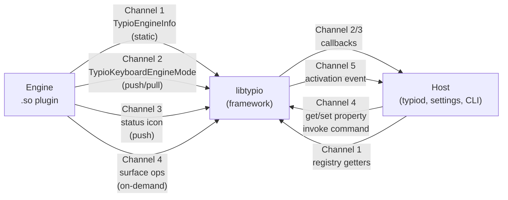
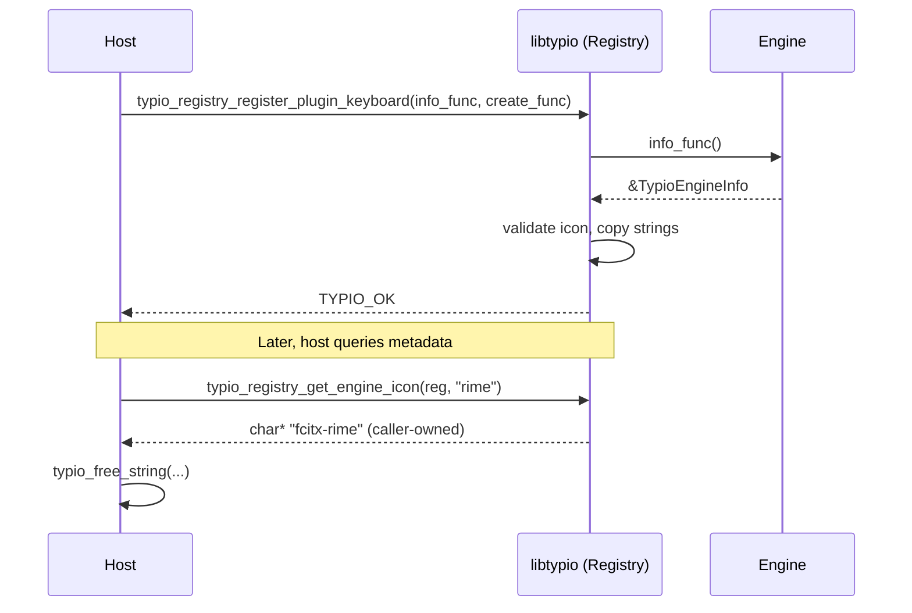
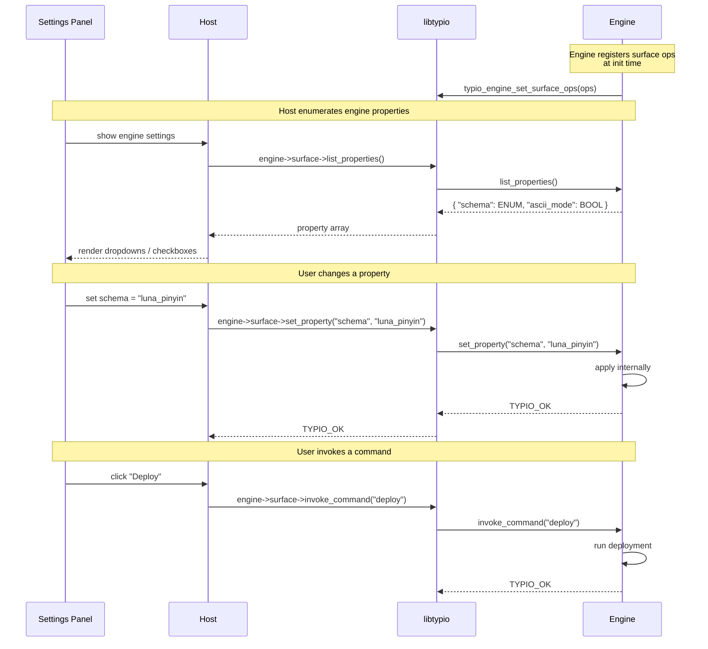
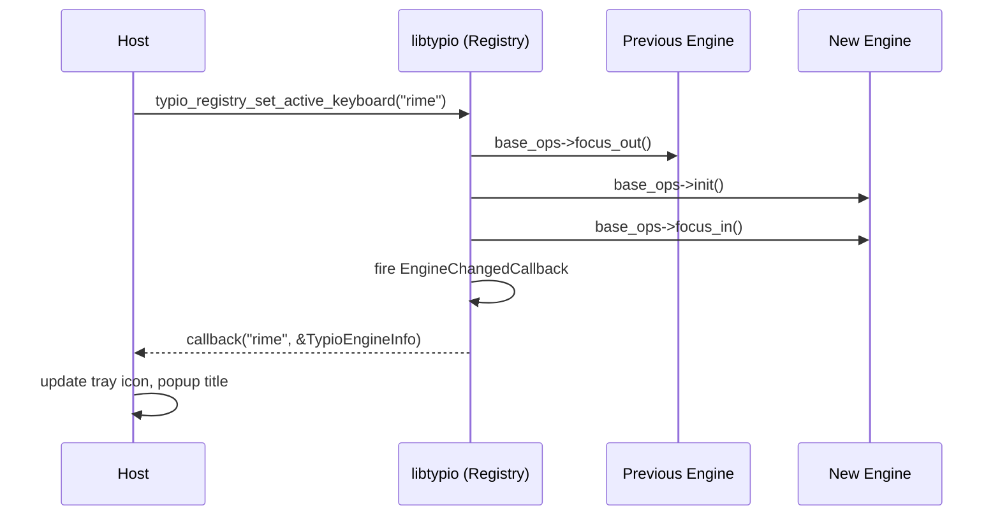

# Engine → libtypio → Host: Resource Flow

This document explains how an engine publishes data such as icons, names,
modes, and properties, and how that data reaches `typio`, control panels,
and CLI clients.

For the engine↔framework runtime contract (key events and composition) see [Engine Contract](engine-contract.md). For the C-level field definitions see [Engine Types](../reference/engine/types.md) and [Registry API](../reference/host-abi/registry.md).

## 1. The Five Resource Channels

An engine has five distinct ways to publish data to the host. Each has a different lifetime, a different transport, and a different validation policy.



| # | Channel | Direction | Lifetime | Validated by libtypio? |
|---|---------|-----------|----------|------------------------|
| 1 | `TypioEngineInfo` (static metadata) | Engine struct → registry snapshot | Set at registration; immutable for the load | Yes (icon string, structure size) |
| 2 | `TypioKeyboardEngineMode` (current sub-mode) | Engine call → instance state → callback | Pushed any time the mode changes | No (forwarded verbatim) |
| 3 | Status icon | Engine call → instance state → callback | Pushed any time the tray icon changes | No (forwarded verbatim) |
| 4 | `TypioEngineSurfaceOps` (properties + commands) | Engine vtable → host on demand | Per call; engine owns memory until next call | No (host enforces ENUM choices) |
| 5 | Activation events | Registry → callback | Fires when active engine changes | N/A |

The rest of this document walks each channel: who writes it, what libtypio does in the middle, and how the host reads it.

## 2. Channel 1: Static Metadata via `TypioEngineInfo`



This is the channel the original question refers to ("engine → lib → host" for icons).

### 2.1 What the engine sets

The engine's `info_func` returns a populated `TypioEngineInfo`:

```c
static const TypioEngineInfo INFO = {
    .struct_size  = sizeof(TypioEngineInfo),
    .name         = "rime",
    .display_name = "Rime",
    .description  = "Rime input method engine",
    .author       = "Rime Team",
    .icon         = "fcitx-rime",        /* freedesktop name or absolute path */
    .language     = "zh_CN",
    .type         = TYPIO_ENGINE_TYPE_KEYBOARD,
    .required_capabilities = REQUIRED,
    .optional_capabilities = OPTIONAL,
};
```

All strings are engine-owned. The pointer must remain valid for the lifetime of the engine.

### 2.2 What libtypio does

When the host calls `typio_registry_register_plugin_keyboard` (or `_voice`), libtypio:

1. Calls the engine's `info_func` once.
1. Validates the `icon` string against the rules in [Engine Icon Reference](../reference/engine/icons.md): freedesktop name or absolute path, no URLs, no `..`, no `~`, no empty strings. Invalid icons are logged and dropped to `None`.
3. **Copies** every string into registry-owned storage. The engine's pointers are not retained.
4. Stores the snapshot in the registry's engine table keyed by `name`.

The copy step matters: it means the engine can unload safely without invalidating data the host already read, and it gives libtypio a chance to normalize fields without mutating engine memory.

### 2.3 What the host reads

The host pulls each field through a registry getter:

```c
char *icon = typio_registry_get_engine_icon(registry, "rime");
char *desc = typio_registry_get_engine_description(registry, "rime");
/* … */
typio_free_string(icon);
typio_free_string(desc);
```

Each getter returns a freshly allocated copy; the host frees it with `typio_free_string`. Alternatively, `typio_registry_get_engine_info` returns the whole snapshot (released with `typio_engine_info_free`).

The host never sees the engine's original `TypioEngineInfo` pointer.

## 3. Channel 2: Current Sub-Mode via `TypioKeyboardEngineMode`

Static metadata describes the engine; the *mode* describes what state it is in right now (Hiragana vs Katakana vs ASCII; Chinese vs English; etc.).

### 3.1 What the engine sets

Two routes:

- **Pull**: `TypioKeyboardEngineOps::get_active_mode` returns the current mode. The host (or framework) can call this any time.
- **Push**: the engine calls `typio_instance_notify_keyboard_mode(instance, &mode)` when its mode changes.

```c
TypioKeyboardEngineMode mode = {
    .id            = "hiragana",
    .label         = "Hiragana",
    .display_label = "あ",
    .icon_name     = "input-keyboard-hiragana",
    .salience      = TYPIO_STATUS_SALIENCE_NOTABLE,
};
typio_instance_notify_keyboard_mode(instance, &mode);
```

### 3.2 What libtypio does

`typio_instance_notify_keyboard_mode`:

1. Compares `mode.id` against the last mode; if equal, it is a no-op (this is why engines can safely call it on every keystroke).
2. Copies the strings into instance-owned storage.
3. Fires the registered `TypioKeyboardModeChangedCallback`.
4. Derives the status icon from `mode.icon_name` and fires the status-icon-changed callback (see Channel 3).

The mode passed to the callback is libtypio-owned and lives until the next mode change.

### 3.3 What the host reads

```c
typio_instance_set_keyboard_mode_changed_callback(instance, on_mode_changed, user_data);
/* or, for a synchronous pull: */
const TypioKeyboardEngineMode *mode = typio_instance_get_last_keyboard_mode(instance);
```

Mode icons follow the same freedesktop / absolute-path convention as static icons but are **not** validated by libtypio — the host decides how to resolve them. This is because mode icons change rapidly and validation cost would be paid on every keystroke, while engine icons are validated once at registration.

## 4. Channel 3: Status Icon (Tray Indicator)

The status icon is a single string the host shows in the tray or panel. It is conceptually a derived view of the current mode, but engines can also push it directly without changing the structured mode.

```c
typio_instance_notify_status_icon(instance, "input-keyboard-zh");
/* later */
typio_instance_clear_status_icon(instance);
```

libtypio stores the last value and fires `TypioStatusIconChangedCallback`. The host queries the latest via `typio_instance_get_last_status_icon`. This channel exists because not every status change is a mode change — an engine may want to show a "loading" icon during deployment without claiming its mode has changed.

## 5. Channel 4: Properties and Commands via `TypioEngineSurfaceOps`

The first three channels publish a small fixed set of fields. Channel 4 lets an engine expose an arbitrary, *engine-specific* set of runtime-settable values (properties) and actions (commands), without the framework or host needing per-engine code.



### 5.1 What the engine sets

The engine fills `TypioEngineSurfaceOps` and attaches it via `typio_engine_set_surface_ops`. Example: Rime exposes a `schema` property (enum of installed schemas) and a `deploy` command:

```c
static const TypioEngineProperty PROPS[] = {
    { .key = "schema", .label = "Schema", .type = TYPIO_ENGINE_PROP_ENUM,
      .value = "luna_pinyin", .choices = installed_schemas },
};
static const TypioEngineCommand CMDS[] = {
    { .id = "deploy", .label = "Deploy" },
};
```

`list_properties` returns the array, `get_property` / `set_property` read and write a single value, `list_commands` lists commands, `invoke_command` runs one.

### 5.2 What libtypio does

Almost nothing — libtypio is a pure passthrough for this channel. The host calls the vtable through helpers on the engine struct. All strings returned are engine-owned and only valid until the next call on the same engine (the host must copy if it needs to retain).

### 5.3 What the host reads

The host enumerates properties and commands and renders them generically: a settings panel can offer a dropdown for an `ENUM`, a checkbox for a `BOOL`, and a text field for a `STRING`, with no knowledge of what `schema` or `deploy` mean.

This is how Typio avoided baking `SetRimeSchema` / `DeployRimeConfig` into the framework: the engine declares its surface, the host renders it.

## 6. Channel 5: Activation Events

When the host calls `typio_registry_set_active_keyboard` (or `_voice`), the registry fires `TypioEngineChangedCallback` with the new active engine's `TypioEngineInfo` snapshot. The host uses this to update its tray icon, the title of the candidate popup, and any other UI bound to the active engine. This is not a separate data channel so much as a notification that Channel 1 should be re-read.



## 7. Memory Ownership at a Glance

| Pointer | Owner | Valid until |
|---------|-------|-------------|
| `TypioEngineInfo *` returned by `info_func` | Engine (static) | Plugin unload |
| Strings inside the registry snapshot | libtypio | `typio_registry_unload` |
| `char *` returned by `typio_registry_get_engine_icon` etc. | Caller | `typio_free_string` |
| `TypioEngineInfo *` returned by `typio_registry_get_engine_info` | Caller | `typio_engine_info_free` |
| `TypioKeyboardEngineMode *` in mode-changed callback | libtypio | Next mode change |
| Strings inside `TypioEngineSurfaceOps` returns | Engine | Next call on same engine |

The pattern: anything libtypio hands back through a `_get_*` function is freshly allocated for the caller; anything passed through a *callback* is libtypio-owned and only valid for the callback's lifetime; anything from `TypioEngineSurfaceOps` is engine-owned and transient.

## 8. Why Validate Only the Static Icon?

Channel 1's icon validation is the only place libtypio enforces content rules on engine-supplied strings. The reasons:

- **Path icons are filesystem references** that the host will later resolve. A malicious or buggy engine returning `"file:///etc/shadow"` or `"../../etc/passwd"` could cause a host to read the wrong file. Validating at registration cuts the attack surface to one chokepoint.
- **The validation cost is paid once.** Mode icons change on every keystroke; per-event validation would not be free.
- **Hosts already need a fallback path** for missing icons. The validation merely promotes a category of malformed inputs (URLs, relative paths) to the same "missing icon" outcome that already had to be handled.

See [Engine Icon Reference](../reference/engine/icons.md) for the exact ruleset.

## 9. Adding a New Resource

The five channels above are the entire engine → host resource surface. Before adding a new field, ask: which channel should carry it?

| If the value is… | Use channel |
|------------------|-------------|
| Set once at engine load and never changes | 1 — `TypioEngineInfo` |
| A structured state with id + label + icon + profile | 2 — `TypioKeyboardEngineMode` |
| A single string for the tray | 3 — status icon |
| Anything else, runtime-settable or actionable | 4 — surface ops (properties / commands) |

Resist adding a sixth channel. The surface-ops vtable was designed to absorb engine-specific data without requiring an ABI bump; almost every "I need to expose X" use case is a property or a command. Adding fields to `TypioEngineInfo` is reserved for data that is genuinely universal across all engines, present and future — name, language, icon — and is gated by the `struct_size` field (see [Engine Types](../reference/engine/types.md)).

## See Also

- [Engine Icon Reference](../reference/engine/icons.md) — the exact validation rules for Channel 1's icon
- [Engine Types](../reference/engine/types.md) — C struct definitions on the engine side
- [Registry API Reference](../reference/host-abi/registry.md) — C functions on the host side
- [Engine Contract](engine-contract.md) — the runtime (key event) half of the engine↔framework boundary
- `typio-settings` repository, `docs/explanation/control-surfaces.md` — how hosts render Channel 4 surface ops in UI
