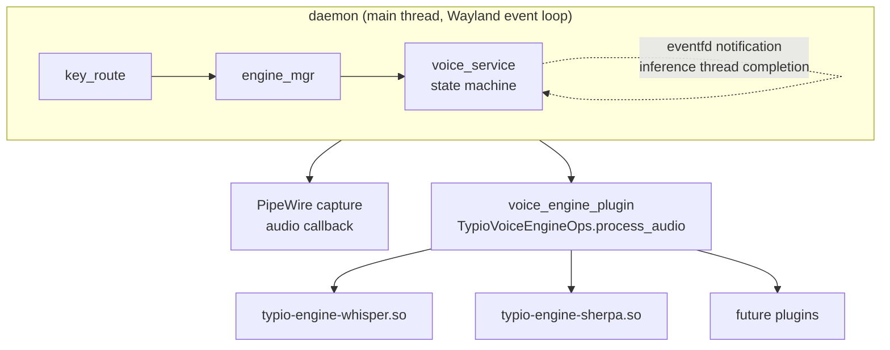

# Voice Input Architecture

Typio's voice input is a secondary pipeline that runs alongside the active keyboard engine. It does not replace keyboard input; the two are selected independently and operate in parallel.

## Design Goals

1. **Non-blocking inference** — Audio capture and speech recognition must not stall the Wayland event loop.
2. **Hot model swap** — Changing voice engine or model config at runtime must not interrupt an in-flight recognition job.
3. **Backend agnosticism** — The voice service owns audio and threading; voice engines only load models and run inference.
4. **Graceful degradation** — If the model is missing or the engine fails to load, voice input is simply unavailable; the daemon keeps running.

## Component Layers

Voice engines are **external plugins** loaded at runtime by the engine manager, just like keyboard engines. They are not built into `libtypio.so`.

## State Machine

The voice service has three states:

| State | Transitions | Description |
|-------|-------------|-------------|
| `IDLE` | `start()` → `RECORDING` | No audio capture; engine may be present or absent |
| `RECORDING` | `stop()` → `PROCESSING` | PipeWire callback appends float32 samples to a growable buffer |
| `PROCESSING` | inference done → `IDLE` | A detached pthread runs `engine->voice->process_audio()`; result arrives via `eventfd` |

The main thread never blocks on inference. When `eventfd` becomes readable, `voice_service_dispatch()` joins the thread, retrieves the text result, and commits it through the focused `TypioInputContext`.

## Engine Lifecycle

Voice engines implement the same `TypioEngineBaseOps` lifecycle as keyboard engines:

- `init` — allocate engine-private state
- `focus_in` — lazy-load the model (sherpa-onnx auto-detects model type; whisper loads `ggml-<name>.bin`)
- `deactivate` — unload the model to free memory
- `destroy` — free all engine-private resources
- `process_audio` — run inference and return heap-allocated text

This means a voice engine is a standard engine that happens to implement `TypioVoiceEngineOps` instead of `TypioKeyboardEngineOps`. It is registered with `typio_registry_register_plugin_voice()` and selected with `typio_registry_set_active_voice()`.

## Audio Pipeline

- **Format**: PCM float32, mono, 16 kHz.
- **Capture**: PipeWire via `typio_pw_capture_*`.
- **Buffer**: Pre-allocated for 30 seconds; grows dynamically if the user holds PTT longer.
- **Threading**: The audio callback runs on a PipeWire realtime thread. It only copies samples into the buffer under `buffer_mutex` and never allocates memory.

## Reload Semantics

Voice config reloads follow these rules:

1. If the service is `IDLE`, the new engine/model is activated immediately.
2. If the service is `RECORDING` or `PROCESSING`, the reload is **deferred** (`reload_pending = true`).
3. When the current job finishes and the state returns to `IDLE`, the deferred reload is applied before the next `start()`.

This avoids tearing down a backend while it is still needed.

## Integration with the Registry

Voice engines are registered in `TypioRegistry` with type
`TYPIO_ENGINE_TYPE_VOICE`. The registry tracks two independent active
slots, one keyboard and one voice; switching one does not evict the
other.

`typio_registry_set_active_voice("whisper")` sets the voice slot. There
is no implicit routing — keyboard and voice APIs are fully separated.

The voice service snapshots the active voice engine at startup and after
each reload. It does not own the engine; the registry owns lifecycle and
destruction.

## Failure Modes

| Symptom | Cause | User-visible effect |
|---------|-------|---------------------|
| Voice unavailable, reason "no voice engine active" | No voice engine selected or engine not installed | PTT shortcut does nothing |
| Voice unavailable, reason "voice backend failed to initialize" | Model file missing or incompatible | PTT shortcut does nothing |
| Voice unavailable, reason "audio capture unavailable" | PipeWire not running or permission denied | PTT shortcut does nothing |
| Empty recognition result | Silent audio or model mismatch | Nothing committed |

All failure modes are logged at `TYPIO_LOG_WARNING` or `TYPIO_LOG_ERROR`.

## See Also

- [How to Create a Custom Voice Engine](../how-to/create-custom-voice-engine.md) — step-by-step guide for voice engines
- [Engine Contract](engine-contract.md) — §5.6 explains how voice fits the same commit-only contract
- [ADR-0002: C ABI as the Only Public Interface](../adr/0002-c-abi-as-the-only-public-interface.md)
