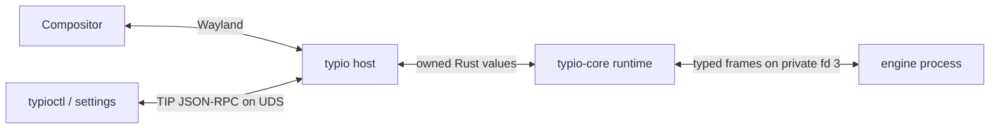

# Runtime architecture

Typio has three deliberately different boundaries:

`typio-host` owns Wayland, the event loop, panel rendering, PipeWire capture,
system integration, engine discovery, and TIP. `typio-core` owns portable
runtime policy and state. Engine executables own language or speech logic and
cannot share pointers or crash the daemon address space.

The host/runtime edge is not a distribution interface. Both crates live in one
workspace and use normal owned Rust types such as `String`, `Vec`, `Box`,
`Rc<RefCell<_>>`, and `Arc<Mutex<_>>` according to their thread model. No raw
pointer, user-data callback, or manually synchronized layout is required.

The engine edge is the versioned Typio Engine Protocol. The host spawns a
manifest-declared executable, maps a private socket to fd 3, validates an
`EngineHello`, and exchanges bounded typed requests and replies. The standard
streams remain available for logs. Discovery, activation, poisoning,
respawning, and shutdown are all owned by `ProcessBackend`.

TIP is unrelated to the engine protocol. It is an external control API for
clients such as `typioctl` and `typio-settings`; those clients never receive an
engine fd or call runtime objects directly.

This split gives each compatibility promise one owner:

| Concern | Owner |
|---|---|
| Wayland object and serial lifetime | host |
| Config, language, registry, and context policy | runtime |
| Engine framing and payload encoding | `typio-engine-protocol` |
| Manifest parsing and path resolution | `typio-engine-manifest` |
| External control methods | TIP service |
| Engine conformance | `typio-vet` at the process boundary |

See [ADR-0046](../../../../docs/adr/0046-engine-protocol-only-runtime.md)
for why the former ABI was removed.
