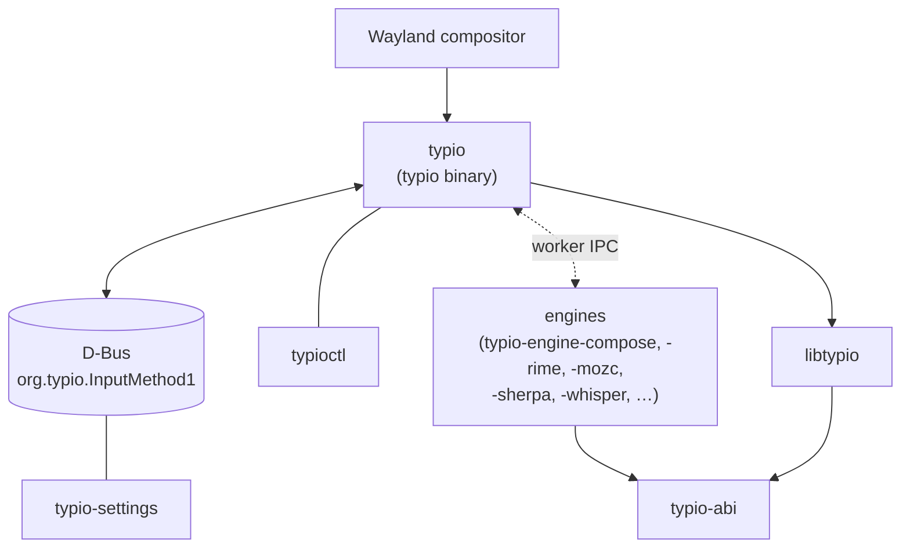

# Architecture Overview

## Overview

Typio is split into a small platform-neutral core library (`libtypio`) and a
Linux host crate (`typio-host`, building the `typio` binary) in the
`typio` workspace. Engines — e.g. the Latin `compose` keyboard engine,
`rime`, `mozc` — are out-of-process workers discovered by the host at runtime.
The framework itself ships no engine; if no engine is installed, unhandled
keys pass through to the focused application unchanged.



## Workspace and Related Repositories

The Typio ecosystem keeps the Linux host, framework, ABI crate, and vet tool
in one Cargo workspace, while engines and external clients remain separate
repositories. Engine packages release on their own cadence; Typio Engine
Protocol and the engine ABI are the cross-repo contracts.

| Component | Role | Language |
|---|---|---|
| `crates/typio-core` | Platform-neutral core library and the public C ABI for hosts and engines | Rust → C ABI |
| `crates/typio-host` | Linux host. Builds the `typio` binary. Owns the input-method protocol, keyboard grab, candidate UI, UDS control surface, tray, voice plumbing, and engine discovery | Rust |
| `crates/typio-abi` | Shared C ABI type definitions for Rust engines and test tools. Zero-implementation workspace member; keeps Rust engines in sync without linking the full framework library | Rust (types only) |
| `crates/typio-vet` | Engine conformance checker and mock host harness | Rust |
| `crates/typioctl` | Command-line client. Speaks UDS JSON-RPC to a running `typio` daemon | Rust |
| `typio-settings` | GTK4 settings panel. Edits configuration through `libtypio`; reflects/changes runtime state over the host's D-Bus interface | GTK4 |
| `typio-engine-compose` | Latin keyboard engine with compose picker for accented characters. Optional; the framework runs with zero engines installed | Rust |
| `typio-engine-rime` | Rime IME engine (CJK input via librime) | C++ |
| `typio-engine-mozc` | Mozc IME engine (Japanese) | C++ |
| `typio-engine-sherpa` | sherpa-onnx voice engine | C++ |
| `typio-engine-whisper` | whisper.cpp voice engine | C++ |
| `examples/engine-template/` | Starter template for new engines — lives in `libtypio` | C |

Every engine is built as a separate engine executable and
declared by a `typio-engine-*.toml` manifest. Installed executables live under
`<libexecdir>/typio/engines`; installed manifests live under
`<datadir>/typio/engines`. **There are no in-tree built-in engines**:
`libtypio` and `typio-host` ship no engine implementation.

The dependency direction — the host and framework share one workspace, engines
depend only on the protocol/ABI, and `typioctl` reaches the host only over UDS
— is the rule the split encodes. See [project-layout.md](../dev/project-layout.md)
for the in-repo file map.

## Main Components

### `libtypio`

Located at `crates/typio-core/` in the `typio` workspace.

The C ABI in `include/typio/*.h` is the sole officially supported public interface — Rust is an implementation detail, not a public API. See [ADR-0002](../adr/0002-c-abi-as-the-only-public-interface.md). **No platform dependencies**: `libtypio` knows nothing about Wayland, D-Bus, GTK, Vulkan, or the event loop.

Responsibilities:

- instance lifecycle
- engine registration (host hands engines to the registry)
- input context state
- configuration parsing
- key and voice event structures
- shared utility code

Internal split:

- `include/typio/` — installed public C ABI headers (hand-written, single source of truth)
- `Cargo.toml` + `src/` — the `libtypio` Rust crate that implements the entire ABI (config, input context, engine registry, schema registry, key events, logging, string utilities)

### `typio`

Lives in the `typio` repository. Builds the `typio` daemon binary
(sources under `crates/typio-host/src/`).

Responsibilities:

- connect to the Wayland display
- bind `zwp_input_method_manager_v2`
- operate within sessions where applications and the compositor expose `zwp_text_input_manager_v3`
- bind `wl_compositor` for candidate popup surface creation
- create per-activation Typio sessions
- grab keyboard input through the input-method protocol
- translate XKB keyboard state into `TypioKeyEvent`
- forward commit and preedit callbacks back into Wayland protocol requests

Within the Wayland host, responsibilities are intentionally split by layer (`src/wayland/`):

- `wl_input_method.c` — protocol-facing text entry updates and preedit round-trip decisions
- `text_ui_backend.c` — backend boundary for Typio-managed text UI
- `popup/candidate_panel.cc` — Wayland-native popup backend over `zwp_input_popup_surface_v2`
- `popup/candidate_panel_layout.cc` — text measurement and geometry computation
- `popup/candidate_panel_paint.cc` — Flux pixel rendering
- `key_route.c` — key-routing decisions
- `wl_keyboard.c` — keyboard-grab event handling, XKB updates, emergency-exit fast path
- `wl_event_loop.c` — polling loop, Wayland dispatch, watchdog, auxiliary-fd integration
- `wl_runtime_config.c` — runtime config reload, shortcut refresh, config-watch rearming
- `wl_frontend.c` — frontend construction, registry/global binding, teardown glue

Observability ownership follows the same boundary split. Control-surface binding rules live in the `typio-settings` repository's `docs/explanation/control-surfaces.md`.

### `typioctl`

Lives in the `typioctl` repository (Rust). Built as the `typioctl` binary.

A standalone command-line client (`typioctl engine`, `typioctl status`, …) that interacts with a running host over UDS (Unix Domain Socket). It links nothing from `libtypio`.

Responsibilities:

- provide a CLI for querying and controlling a running Typio host
- the `typio` host is started separately
- communicate over the UDS socket (`$XDG_RUNTIME_DIR/typio/daemon.sock`)
- no dependency on `libtypio`; pure IPC client

### `typio-settings`

Lives in the `typio-settings` repository.

Responsibilities:

- provide a GTK preferences panel for runtime state and persistent configuration
- consume the D-Bus status surface exposed by the host
- reuse `libtypio` config and schema helpers where shared parsing logic is preferable to duplicating it in UI code

The D-Bus surface itself is the host's contract, not libtypio's; see the
`typio` repository for the full protocol specification.

### `typio-engine-compose`

Located in the `typio-engine-compose` repository (`src/main.rs`). Built as the
`typio-engine-compose` engine executable and discovered through
`typio-engine-compose.toml`.

Responsibilities:

- a Latin keyboard engine, not a framework default
- commits printable Unicode text directly, with no language data
- provides a Shift+Alt compose picker for accented characters

It is **not** built into `libtypio` or `typio`, and is not required for
the framework to run. If no engine package is installed, the host passes
unhandled keys through to the focused application unchanged.

Rust engines such as `compose` depend on the **`typio-abi`** crate for shared `#[repr(C)]` types (`TypioEngineInfo`, `TypioKeyEvent`, the vtable structs, etc.). This avoids replicating ABI definitions by hand and guarantees the engine's layout matches the host's exactly. C and C++ engines continue to include the C headers under `include/typio/abi/` directly. See [project-layout.md](../dev/project-layout.md) for the crate split rationale.

## Engine Manager Model

`TypioRegistry` ([ADR-0005](../adr/0005-internal-engine-backend-abstraction.md)) is the sole engine-management surface. Engines
are loaded as external shared objects from the host-supplied engine
directories — there are no in-tree built-in engines.

For external engines, Typio expects exported symbols:

- `typio_engine_get_info`
- `typio_engine_create`

Each engine instance receives a config path such as:

```text
~/.config/typio/engines/<engine>.toml
```

Engines that share Typio's main config file read their section from the root `~/.config/typio/core.toml`, typically under keys such as `[engines.rime]` and `[engines.mozc]`.

Activation rules:

- engine instances are created lazily when an engine is selected
- switching a keyboard engine never evicts the active voice engine
- switching a voice engine never evicts the active keyboard engine
- if creating or activating the requested engine fails, the manager attempts to restore the previously active engine in the same category
- next/previous keyboard switching resolves against the ordered keyboard list, not the raw registration table

## Engine Categories

Typio models input engines in two parallel categories:

- `keyboard` — the primary input pipeline. Keyboard engines own key processing, preedit, candidate lists, commits, and status icons.
- `voice` — a secondary pipeline for speech recognition. Voice engines do not replace the active keyboard engine; they run alongside it and are selected independently.

Operational rules:

- there is exactly one active keyboard engine slot
- there is exactly one active voice engine slot
- keyboard and voice selections do not evict each other
- the tray, status bus, and control panel should treat keyboard and voice as separate runtime values, not as one flat engine list

## Runtime Scheduling

The daemon is single-process and event-loop driven. The main loop polls:

- Wayland display events
- keyboard repeat timer
- status D-Bus fd
- tray D-Bus fd
- voice completion fd
- config inotify fd
- config reload timer fd

Scheduling rules:

- Wayland dispatch remains the primary path and must not be starved by auxiliary fds
- D-Bus dispatchers process a bounded number of messages per tick
- config filesystem events are debounced before reload
- the virtual-keyboard keymap deadline can shorten the poll timeout
- voice reloads are deferred while recording or inference is active, then applied once the active job finishes

## IME / Engine Boundary

Typio is the IME host and framework layer, not a replacement for engine-owned language logic.

Authority split:

- engines own linguistic behaviour and engine-specific semantics
- Typio owns protocol hosting, UI integration, and cross-engine control surfaces

In practice, engine ownership includes:

- composition and conversion behaviour
- candidate generation, ordering, selection semantics, and paging
- engine-specific runtime state such as active schema or input mode
- any behaviour that only the upstream engine can define authoritatively

In practice, Typio ownership includes:

- Wayland input-method and popup-surface integration
- `TypioInputContext` as the transport and UI state carrier
- candidate popup rendering, tray/status export, and control-panel plumbing
- Typio-owned persisted config and runtime state publication
- converging user experience where presentation can be standardized without changing engine semantics

Design rules:

- Typio should respect the upstream engine's supported behaviour instead of reinterpreting it locally.
- Typio should prefer official engine APIs, runtime controls, and discovery paths over file-level hacks or private config rewrites.
- Typio may normalize presentation and workflow across engines, but it must not fake unsupported engine semantics just to make engines look identical.
- If an engine does not expose a supported control, preserving the engine's real behaviour is preferred over adding a Typio-side override that would contradict user expectations or upstream design intent.

## Wayland Data Flow

1. The compositor activates the input method.
2. Typio creates or resets a session.
3. Typio grabs the keyboard and builds XKB state.
4. Key presses become `TypioKeyEvent`.
5. The active engine returns one of: not handled, handled internally, composing, committed.
6. Composition and commit callbacks are translated into `zwp_input_method_v2` requests (the composition's preedit via `set_preedit_string`, commit via `commit_string`).
7. The composition's candidate list is rendered through `zwp_input_popup_surface_v2` when the session exposes the necessary Wayland globals. If candidate popup rendering is unavailable, Typio keeps candidate state visible inline in preedit.

## Candidate Popup Pipeline

The candidate-list UI is intentionally layered so state and rendering stay separate:

1. the keyboard engine owns candidate content and the selected index
2. `TypioInputContext` stores the composition (preedit + candidates) as the UI source of truth
3. the composition callback marks the popup dirty; the event-loop flush refreshes it once per iteration, diffing against the last composition sent
4. `text_ui_backend.c` provides the Typio-side UI backend boundary
5. `candidate_panel.cc` classifies the change and dispatches to the correct render path over `zwp_input_popup_surface_v2`

The important architectural rule is that the refresh path depends on the text-UI backend abstraction, not on a concrete popup implementation.

### Delta classification

Every update is first classified into one of five `PopupDelta` values before any rendering work begins:

| Delta | Trigger | Action |
|-------|---------|--------|
| `NONE` | Nothing visible changed | Skip rendering |
| `SELECTION` | Only selected index changed | Full repaint (fast on persistent surface) |
| `AUX` | Only preedit / mode label changed (same popup size) | Full repaint (fast on persistent surface) |
| `CONTENT` | Candidate list changed (page navigation) | Full repaint |
| `STYLE` | Font, theme, or output scale changed | Cache invalidation + full repaint |

Classification is a pure comparison of the incoming state against the cached `PopupGeometry` snapshot and costs no rendering work.

### Geometry and layout cache

`PopupGeometry` is an immutable snapshot of all computed candidate positions and auxiliary text positions for one page. The selected index is **not** part of the geometry; changing the selection never requires re-measuring text or recomputing positions.

Text measurement and `TypioTextLayout` objects are owned by `PopupRenderCtx`, a persistent per-popup structure holding a 128-entry LRU cache. Cache entries are keyed by `FNV-1a(formatted_text + font_desc + color)`. Layouts are shaped through HarfBuzz; at paint time each shaped glyph's FreeType outline is decomposed into a `flux_path` and filled on the GPU canvas (no glyph bitmaps, resolution-independent).

### Paint paths

`candidate_popup_paint.c` records the popup into a flux canvas: the background is the canvas clear colour, the border / selection highlight / mode divider are solid `flux_canvas_fill_rect` calls, and text is filled glyph outlines (`typio_flux_fill_layout`).

The popup coordinator (`candidate_popup.cc`) owns the GPU frame lifecycle. It creates a flux (Vulkan) **swapchain** directly on the input-popup `wl_surface` (`vkCreateWaylandSurfaceKHR` → `flux_surface_create` → `flux_canvas_create`), and per update runs `flux_surface_begin_frame` → `flux_canvas_begin(clear)` → record → `flux_canvas_end` → `flux_frame_submit` → `flux_frame_present`. The swapchain is resized with `flux_surface_resize` when the popup size changes. Because the swapchain owns frame pacing and buffering, there is no SHM buffer pool and no manual frame-callback throttle.

The present runs synchronously on the event-loop thread, so
`flux_surface_begin_frame` uses a bounded timeout. See the `typio` ADR
set for host rendering decisions.

## Keyboard Safety Model

The Wayland keyboard grab path stamps every key with the current grab **epoch** and tracks forwarded keys for symmetric release in `key_tracking.{c,h}`. A key whose epoch ≠ the current grab epoch is dropped at routing — the single fence for stale keys (re-sends across rebuild, suspend, or reconnect). Grab build/teardown, including the brief modifier carry across a focus handoff, is part of `session_effects` `apply`, not a separate boundary module.

The intended forwarding model is conservative: if the IME does not consume a key, Typio forwards the original press/release sequence and separately keeps the virtual keyboard modifier state in sync. Modifier changes must not trigger synthetic releases for unrelated non-modifier keys in the main key path.

The rules for this path live in the `typio` ADR set. Any change to grab
lifecycle or epoch fencing should update those alongside the code.

## Current Scope

Implemented:

- Wayland input method frontend
- Wayland-native protocol stack based on `zwp_input_method_manager_v2` and compositor/application `zwp_text_input_manager_v3`
- keyboard grab and XKB integration
- commit/preedit callback bridge
- candidate popup surface rendering over pure Wayland protocol objects
- dynamic engine loading ABI
- out-of-tree engines — `typio-engine-compose` (the keyboard fallback),
  `typio-engine-rime`, `typio-engine-mozc`, `typio-engine-sherpa`,
  `typio-engine-whisper`, … — built as engine executables and registered
  from host-owned manifests
- automated tests

Still limited in this repository:

- popup candidates are keyboard-driven; no pointer interaction layer is implemented
- richer compositor integration beyond the current input method protocol path

## Ownership Rules

These are data-structure-level ownership rules.

- `TypioInstance` owns `TypioRegistry`, `TypioConfig`, and created contexts.
- `TypioInputContext` owns its preedit, candidates, and property storage.
- `TypioWlFrontend` owns the Wayland connection, popup surface, current session, and keyboard grab.
- `TypioVoiceService` owns the PipeWire capture, the audio buffer, the inference thread, and the `eventfd` notification.
- Engine implementations own their own `user_data`.

For persisted config vs runtime-state ownership across daemon and control surfaces, see [Config & Runtime Ownership](config-runtime-ownership.md).
