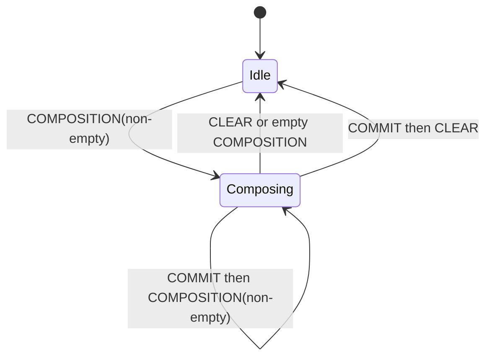

# Composition state machine

Every `TypioInputContext` owns one current `Composition` and an ordered queue of
`ContextOutput` events. The empty composition is the idle state.

A composition is an atomic snapshot containing preedit segments, cursor,
candidates, page metadata, selection, paging flags, and host-managed selection
flags. Replacing the whole value prevents preedit and candidate state from
observing different revisions.

A commit is not state. It is a one-shot ordered event because a key may commit
final text and also begin or retain another composition. The runtime therefore
queues commits and composition changes in reply order; the host drains them and
applies the corresponding Wayland requests during its normal flush phase.

Focus changes do not destroy the input context. `FocusOut` hides visible state
at the host boundary, while the engine may retain per-context language state
under the stable numeric context id. `Reset` explicitly abandons the current
composition. Context destruction finally releases runtime state.

Candidate clicks are routed as `CommitCandidate { context_id, index }`, not
turned into synthetic keyboard input. Selection-only keyboard navigation can
be host-managed when the composition flags allow it; otherwise it is sent to
the engine so language-specific policy remains authoritative.
