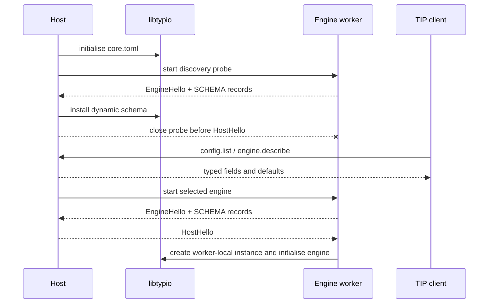

# Configuration system

Typio describes each known configuration key once with a
`TypioConfigField`. The same schema drives type checking, defaults, CLI
introspection, and settings metadata.

## Ownership layers

The schema has two layers:

| Layer | Owner | Keys | Installed when |
|---|---|---|---|
| Static | libtypio | Framework policy such as shortcuts and notifications | Library startup |
| Dynamic | Engine worker | `engines.<name>.*` | Manifest discovery |

Frontend presentation does not belong in either layer. The reference host
stores popup layout, fonts, and colour choices in `platform.toml`.

An engine declares its dynamic fields through
`typio_engine_get_config_schema`. The canonical worker harness performs two
actions with that table:

1. registers it locally before creating the worker's `TypioInstance`, so the
   engine receives typed defaults;
2. serialises it into EngineHello, so the host can expose the same fields to
   TIP clients before the engine is active.

The host validates every field, requires the `engines.<name>.` namespace, and
replaces that engine's previous schema atomically. A malformed schema rejects
the discovery probe without partially changing the registry.

## Startup order

Discovery executes only trusted manifests from the configured engine search
directories. The probe must be cheap: workers publish metadata and schema
before loading dictionaries or ML models, and must tolerate the channel
closing without HostHello.

## Persistent files

| File | Owner | Purpose |
|---|---|---|
| `core.toml` | libtypio through the host | Framework and per-engine user intent |
| `platform.toml` | Reference host | Frontend presentation |
| `engine-state.toml` | Engine registry | Last active language and engine choices |
| `identity-engine-state.toml` | Host/core identity layer | Per-application engine and mode memory |

Unknown keys already present in `core.toml` are preserved on round trip. This
allows an engine to be temporarily uninstalled without destroying its
configuration. TIP refuses a brand-new unknown key because it has neither a
schema type nor an existing stored type.

## Defaults and strict writes

`typio_config_apply_defaults` fills missing schema keys without overwriting
user values. An empty string default means “leave the key absent.”

The TIP v3 configuration methods are the supported remote mutation surface:

| Method | Behaviour |
|---|---|
| `config.get` | Return the stored value or schema default, with type and source |
| `config.list` | Enumerate stored and schema-only values, optionally by prefix |
| `config.set` | Parse using the schema or an existing value's type, validate choices/ranges, save, and reload |
| `config.unset` | Remove the user value and expose the schema default again |
| `config.show` | Serialise the current config |
| `config.reload` | Re-read files and refresh runtime consumers |

Control surfaces must use TIP over the daemon's owner-only Unix socket. They
must not edit `core.toml` behind the daemon's back. D-Bus remains an
implementation detail for the StatusNotifierItem tray and desktop services;
it is not Typio's configuration protocol.

## Reload behaviour

The reference host watches `core.toml`, `platform.toml`, and the engine config
directory. File events are debounced so editor save sequences collapse into a
single reload. Accepted changes are saved before runtime refresh; invalid
typed values are rejected without replacing the current configuration.

On reload, libtypio reapplies defaults and forwards `reload-config` to active
workers. Engine choice rollback is independent for keyboard and voice: a
failed replacement must not discard a still-usable previous engine.

## Adding a field

For a framework key:

1. add a `TypioConfigField` to `config_schema.rs`;
2. add UI metadata only when a generic client should render it;
3. update the configuration reference and tests.

For an engine key:

1. add the field to the engine's static schema table under
   `engines.<engine-name>.*`;
2. return that table from `typio_engine_get_config_schema`;
3. read the value from the worker-local `TypioInstance`;
4. document and test the field in the engine repository.

No libtypio release is required merely to add an engine-owned field.

## Invariants

- Each persisted key has one schema owner.
- The daemon is the only writer of `core.toml` while it is running.
- Defaults never overwrite user values.
- Dynamic schema replacement is all-or-nothing and namespace-scoped.
- Settings and CLI clients read runtime truth from TIP notifications/status,
  not by guessing from files.
- Engine commands use `engine.invoke`; mutable engine values use
  `config.set`. The two mechanisms do not overlap.
