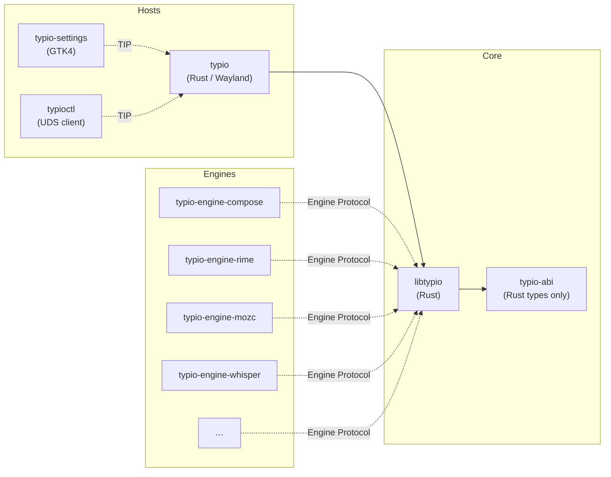

# Crate Organization and the ABI Split

## Why split at all?

Typio could have been a single repository — a Rust crate with Wayland code, GTK settings, and a half-dozen engines all in one tree. We chose not to, for three pressures that shape every boundary in the project:

1. **Platform neutrality.** A future macOS or Windows port should not have to carry Wayland, D-Bus, or Vulkan baggage. The core library must be genuinely platform-agnostic.

2. **Independent release cadence.** Engines evolve on their own schedules: `typio-engine-rime` tracks upstream librime, `typio-engine-mozc` tracks Google Mozc, and voice engines track ML model releases. Tying them to the framework release cycle would create either constant version churn or stale dependencies.

3. **Third-party extensibility.** A distro or user can package a new engine as
   an engine executable plus manifest without touching framework source.

## The crate graph



### `libtypio` — the core crate

A single Rust crate that builds both `libtypio.so` (cdylib) and `libtypio.rlib`. It owns:

- instance lifecycle (`instance/`)
- input context state (`input_context/`)
- engine registry and switching (`core/registry/`)
- configuration parse/save (`config/`)
- C ABI surface (`c_api/`)
- string utilities and allocators (`string.rs`, `log.rs`)

It knows **nothing** about Wayland, GTK, X11, or the event loop. The only platform-specific code is the engine registration surface: the host discovers engine manifests and hands engine argv to `typio_registry_register_engine_process`.

### `typio-abi` — the C-layout type crate

A workspace member at `crates/typio-abi/`. It contains **only** `#[repr(C)]` structs, enums, and type aliases — zero implementation, zero dependencies beyond `std`.

Why does this exist as a separate crate?

- Core and conformance tools share one audited definition of each C layout.
- **Test tools** can import the types without pulling in the full core library.
- **cbindgen** runs against `typio-abi` to produce the C headers under `include/typio/abi/`.

A pure Rust worker may implement Typio Engine Protocol directly and need no
Typio crate dependency, as `typio-engine-compose` does.

### Host and control repositories

| Repository | Language | Links against | Reason for separation |
|---|---|---|---|
| `typio` | Rust | `libtypio` crate | Linux host integration: Wayland, candidate UI, TIP, tray D-Bus, and PipeWire. |
| `typio-settings` | GTK4 | TIP client | UI toolkit dependency (GTK4) is heavy and platform-specific. |
| `crates/typioctl` | Rust | nothing | Speaks UDS to the host; does not need libtypio at all. |

### Engine repositories

Every engine is a standalone repo producing an engine executable and a
`typio-engine-*.toml` manifest.

- C engines: Typio headers plus `libtypio.so` for the worker-local instance,
  config, input-context, and protocol support. Engine object lifecycle helpers
  are header-only.
- Rust engines: any Rust crate that speaks Typio Engine Protocol on fd 3.

Hosts conventionally discover installed manifests under
`<datadir>/typio/engines/`; engine executables live under
`<libexecdir>/typio/engines/`. Core bakes in no engine names or paths.

## Split principles

These rules decide whether a new component belongs in `libtypio`, in a host repo, or in an engine repo.

### 1. Core owns business logic; hosts own platform glue

If a decision involves the Wayland protocol, XKB state, GTK widgets, or the event loop, it lives in a host repo. If it involves config parsing, engine switching, or input context state, it lives in `libtypio`.

### 2. Cross-repo contracts stay narrow

`include/typio/` headers are partitioned by audience:

| Layer | Audience | Stability promise |
|---|---|---|
| `typio/abi/` | Native engine workers | Versioned C layouts; payload `struct_size` discipline |
| `typio/runtime/` | Hosts embedding libtypio | Evolves with core releases |
| `typio/schema/` | Config tools & UI | Evolves with core releases |

No repo may reach into another repo's internals. Native engine implementation
files use `typio/abi/abi.h`; the standard worker harness additionally uses the
runtime and schema headers to own its local instance and publish config fields.
Hosts may include `typio/typio.h` (the full umbrella).

### 3. Engines release independently

Engines declare their own version, install their own manifest, and carry their own config schema extensions via `typio_config_schema_register_*`. A framework major bump does not force an engine rebuild unless Typio Engine Protocol or the engine ABI itself breaks.

### 4. No engine `dlopen`

`libtypio` contains no hard-coded engine paths. The host discovers manifests,
resolves argv, and registers process backends. Core starts workers only through
Typio Engine Protocol; it never loads engine code into the host process.

### 5. Cross-process protocols are host concerns

D-Bus and host-control UDS surfaces are owned by the host repository. Typio Engine Protocol is the only cross-process protocol owned by `libtypio`'s engine backend contract.

## The ABI's duty and mission

The C ABI is not merely a convenience layer — it is the **stability contract** that makes the whole ecosystem possible.

### Single source of truth

`include/typio/` headers are hand-written, not generated from Rust sources. They are the authoritative contract. Rust implements them; C engines consume them; cbindgen validates them. If the Rust code and the headers disagree, the headers win.

### Additive evolution

Caller-allocated payload structs carry `struct_size` as their first field:

```c
struct TypioKeyEvent {
    size_t struct_size;  // sizeof(TypioKeyEvent) at the sender's build time
    uint32_t keycode;
    // ...
};
The framework reads only the fields the caller knew about. New payload fields
can be appended without breaking older engines. Engine metadata and vtable
compatibility are gated separately by `typio_engine_abi_version`.

### Version gating

Native workers export `typio_engine_abi_version` for conformance tooling and
build against the versioned `typio-engine-abi.pc` contract. Host compatibility
is negotiated independently by EngineHello's protocol version because the
host never loads the native engine object.

### Ownership clarity

The ABI defines a single deallocator family:

- `typio_free_string` for all `char *` returns
- `typio_free_string_array` for name lists
- `typio_engine_info_free` for engine metadata snapshots

This prevents cross-CRT heap corruption on Windows and makes ownership auditable in code review.

### What the ABI is *not*

- **Not a Rust public API.** The Rust crate is an implementation detail. Only the C headers are stable.
- **Not the engine transport.** Typio Engine Protocol is the process boundary;
  TIP is the host control boundary.
- **Not a UI toolkit binding.** GTK, Qt, or native macOS UI code is a host concern.

## Summary

| Question | Answer |
|---|---|
| Why is `typio-abi` a separate crate? | So core and conformance tools share audited C layouts without implementation coupling. |
| Why is `typio-settings` a separate repo? | So GTK settings UI dependencies stay outside the host/framework workspace. |
| Why do engines live in separate repos? | So they release on their own cadence and third parties can write new ones. |
| Why does core contain no `dlopen`? | So the host owns platform-specific loading and core remains portable. |
| What is the ABI's mission? | To be the narrow, stable, additive-evolution boundary between framework, host, and engine. |
