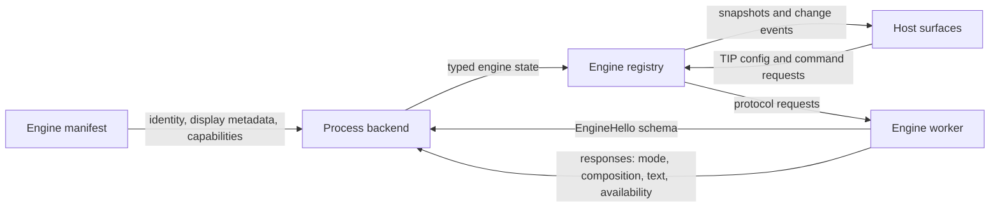

# Engine to host resource flow

Typio engines are manifest-declared worker processes. The daemon never loads an
engine shared object into its address space, and no engine-owned pointer crosses
the process boundary.

For request semantics, see [Engine contract](engine-contract.md). For frame
details, see [Engine protocol](../reference/engine-protocol.md).

## Resource channels



| Channel | Source | Lifetime | Host validation |
|---|---|---|---|
| Manifest metadata | `typio-engine-*.toml` | Registry slot | Required fields, protocol, type, capabilities, icon |
| Config schema | EngineHello `SCHEMA` records | Registry slot | Field encoding, type, namespace, duplicates |
| Keyboard mode | `MODE` / `ACTIVE_MODE` replies | Cached until a later mode reply | Typed decode; identity is mode id |
| Composition and commit | Request response | One request | Bounded frame and typed record parsing |
| Voice text | `TEXT` reply | One request | Hex and UTF-8 decoding |
| Availability | `AVAILABILITY` reply | Refreshed by registry checks | Closed enum |
| Commands | `COMMAND` and invoke reply | Per request | Non-empty id and typed errors |
| Registry events | Registry state transition | Event delivery | Generated by framework state changes |

## Manifest metadata

The manifest is the host's metadata authority. It provides the stable engine
name, kind, executable argv, display strings, languages, icon, and required or
optional capabilities. The loader copies these values into `EngineInfo` and
registers a `ProcessBackend`.

At startup, the worker's EngineHello repeats only the identity needed for
transport validation:

```text
protocol	1.0
engine	rime
type	keyboard
```

The backend rejects a protocol, name, or type mismatch. This prevents a
manifest from accidentally launching a different engine binary while keeping
display metadata independent of C object lifetimes.

## Schema discovery

An engine exports a static `TypioConfigField` table to its worker harness. The
harness registers it locally and appends one `SCHEMA` record per field to
EngineHello.

The host starts a discovery probe, reads that hello, validates all records,
atomically installs the `engines.<name>.*` fields, and closes the process before
HostHello. Heavy engine construction happens only during real activation.

This ordering gives settings and `typioctl config list engines.<name>.` a
complete schema even while the engine is inactive. Unloading the registry slot
removes its dynamic schema.

## Runtime replies

The worker is request/reply driven. Each response echoes the request id, and
the backend rejects unexpected frame types, request ids, record names, invalid
hex, invalid UTF-8, and oversized payloads.

Keyboard requests may return:

- `RESULT` for key routing;
- `COMMIT`, `COMPOSITION`, or `CLEAR` for input-context state;
- `ACTIVE_MODE` when a request changed the engine's current mode;
- `MODE` records when enumerating modes.

Voice inference returns optional `TEXT`. Availability checks return one of
`UNINITIALIZED`, `PREPARING`, `READY`, or `FAILED`.

Mode changes ride on the reply to the request that caused them. The backend
caches the latest mode id and exposes one change to the registry, avoiding a
second asynchronous protocol writer and preserving deterministic ordering.

## Config and commands

Mutable values and actions use different paths:

- persisted engine values are schema fields changed through TIP `config.*`;
- actions are stable command ids listed by `list-commands` and invoked through
  TIP `engine.invoke`.

`TypioEngineSurfaceOps` therefore contains commands only. The removed generic
property vtable is not another configuration channel.

Command replies distinguish an unknown id (`NOT_FOUND`) from an engine without
command support (`NOT_SUPPORTED`). Long-running work should be started by the
command and reflected through availability rather than blocking the control
plane indefinitely.

## Ownership and shutdown

| Object | Owner | End of lifetime |
|---|---|---|
| Manifest strings and `EngineInfo` | Host registry | Slot unload |
| Schema table returned by engine export | Worker binary | Process exit |
| Host's schema copy | Global schema registry | Slot unload or schema replacement |
| Engine object and vtables | Worker | Worker shutdown |
| Worker-local `TypioInstance` and contexts | Worker | Before engine destroy |
| Decoded reply values | Process backend / input context | Replaced by a later reply or context teardown |

Worker teardown deactivates the engine, frees the worker-local instance and its
contexts, then destroys the engine object. This order lets context session
destructors safely refer to engine state and prevents use-after-free during
shutdown.

The host's transport holder kills and reaps a worker after a poisoned channel,
failed handshake, schema probe, or backend drop. A poisoned byte stream is
never reused; the next operation gets a fresh process.

## Adding a resource

Choose the existing channel that matches the value:

| Value | Channel |
|---|---|
| Stable display metadata | Manifest |
| Persisted engine option | Config schema |
| Current keyboard sub-mode | Mode reply |
| Composition or committed text | Input response record |
| Readiness or setup progress state | Availability |
| User-invoked action | Command surface |
| Host-wide state transition | Registry/TIP event |

Adding an ad-hoc record or per-engine TIP method is justified only when none of
these typed channels can represent the value without ambiguity.
