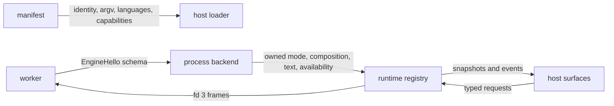

# Engine-to-host resource flow

Typio engines are manifest-declared worker processes. No engine-owned pointer
or executable code crosses into the daemon.

| Resource | Authority | Validation and lifetime |
|---|---|---|
| Manifest metadata | package | shared parser; registry slot |
| Configuration schema | `EngineHello` | typed decode and namespace check; registry slot |
| Mode | worker reply | typed decode; cached until replaced |
| Composition and commit | worker reply | bounded frame; input context |
| Voice text | worker reply | hex and UTF-8 validation; one request |
| Availability | worker reply | closed enum; refreshed on query |
| Commands | worker reply | non-empty ids; one request |

The manifest and handshake identities must agree. Discovery validates schema
and then closes the probe without `HostHello`; activation repeats the
handshake and initializes the worker. A poisoned channel is never reused.

Choose an existing typed channel when adding data: stable display metadata
belongs in the manifest, persisted options in schema, current sub-mode in mode
records, text state in composition/commit records, readiness in availability,
and user-invoked actions in commands.
