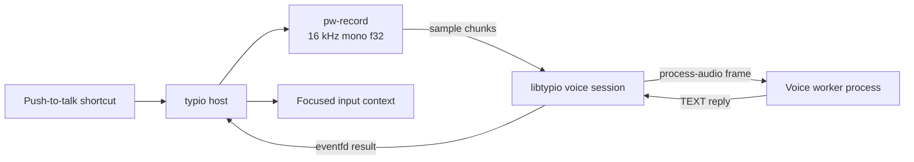

# Voice input architecture

Voice input is a secondary pipeline beside the active keyboard engine. The two
registry slots are independent: switching voice never evicts the keyboard
engine, and switching keyboard never interrupts a voice selection.

## Components

The host delegates capture to PipeWire's `pw-record` command. A reader thread
decodes raw little-endian float samples and feeds the session. The session owns
the recording buffer, inference thread, completion eventfd, and result
delivery. The engine worker only loads its model and handles bounded
`process-audio` requests.

## State machine

| State | Transition | Meaning |
|---|---|---|
| `IDLE` | PTT press → `RECORDING` | Ready; no capture in progress |
| `LOADING` | Engine/model preparation → `IDLE` | Backend is not ready for capture |
| `RECORDING` | PTT release → `PROCESSING` | `pw-record` samples are buffered |
| `PROCESSING` | Worker reply/error → `IDLE` | Inference runs off the event-loop thread |

The event loop polls the voice-session eventfd. It dispatches completed
results only when readable, then commits non-empty text through the focused
`TypioInputContext`. Loading, recording, processing, empty-result, and error
states are reflected in the positioned status banner.

## Engine lifecycle

A voice worker uses the same base lifecycle as a keyboard worker and provides
`TypioVoiceEngineOps::process_audio`:

- `init` allocates backend state after HostHello;
- `availability` reports whether a usable model is ready;
- `deactivate` cancels setup work and releases large model state;
- `reload_config` applies engine-owned schema changes;
- `destroy` joins background work and frees backend state;
- `process_audio` accepts borrowed mono f32 samples and returns allocated
  UTF-8 text.

Workers are isolated executables discovered by manifest. The daemon never
loads whisper.cpp or sherpa-onnx code into its own process.

## Audio contract

| Property | Value |
|---|---|
| Format | Little-endian PCM float32 |
| Range | `[-1.0, +1.0]` |
| Channels | Mono |
| Sample rate | 16 kHz |
| Capture command | `pw-record --raw --rate 16000 --channels 1 --format f32 -` |

The capture thread may allocate and copy; it never writes the engine protocol.
Only the process backend owns that channel.

## Concurrency and switching

Before launching inference, the registry snapshots an owned voice-process
handle. The handle shares the worker transport state, so an engine switch or
slot unload cannot invalidate an in-flight job. Transport requests are
serialised, and a poisoned channel is killed and replaced rather than reused.

The host defers destructive voice reload effects while recording or processing
is active. Dropping the voice controller first during shutdown joins any
in-flight inference before the `TypioInstance` and registry disappear.

## Failure behaviour

| Condition | Result |
|---|---|
| No active voice engine | PTT reports unavailable; daemon continues |
| Model missing/preparing | Availability blocks capture and exposes a reason |
| `pw-record` missing or cannot start | Capture start fails without starting inference |
| Worker timeout/crash | Channel is poisoned, worker is killed/reaped, empty/error result returned |
| Silent audio or empty transcription | Nothing is committed |

Voice failures never stop keyboard routing or the host event loop.

## See also

- [Create a custom voice engine](../how-to/create-custom-voice-engine.md)
- [Engine contract](engine-contract.md)
- [Engine protocol](../reference/engine-protocol.md)
