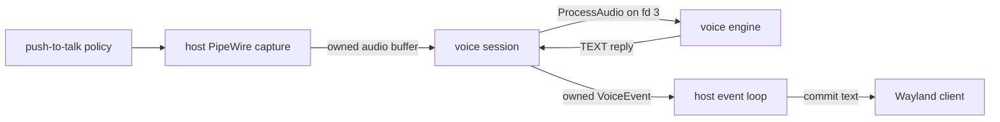

# Voice input

Voice input keeps capture, inference, and text delivery in separate ownership
domains:

The host captures bounded 16 kHz mono little-endian `f32` samples. A cloned
process handle keeps an in-flight worker transport alive without raw pointers
or unsafe thread ownership. Completion is returned through an owned eventfd
queue and applied on the main event loop.

The voice engine owns model loading, readiness, inference, and transcription.
It reports `AVAILABILITY` and accepts `ProcessAudio`; silence may legally
produce no `TEXT`. Switching or unloading registry slots does not invalidate a
job that already owns its handle, and shutdown joins or completes in-flight
work before runtime state is dropped.
