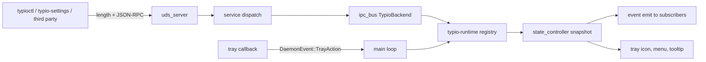

# Subsystem Architecture: Control Plane and Clients

- Status: Living Blueprint
- Last Updated: 2026-09-11
- Scope: core/control — the TIP control surface, its daemon-side dispatch, the shared client crate, `typioctl`, `typio-settings`, language switching, and the tray surface
- Maintainers: Typio maintainers

---

## 1. System Overview & Boundaries

Typio exposes exactly one external control transport: **TIP**, a length-prefixed
JSON-RPC 2.0 protocol on a Unix domain socket. Every client — the command-line
client, the graphical settings application, and any third-party tool — speaks
the same socket with the same envelope. Alongside it sit two *in-process
presentation* surfaces that never define their own control API: the
StatusNotifierItem tray over the session bus, and desktop notifications for
one-way health output.

One owner decides runtime policy regardless of where an action begins. TIP
requests enter the UDS server, cross a transport-agnostic dispatch layer, and
become owned Rust operations on the runtime; tray callbacks enqueue a typed
daemon event that the main event loop applies. Nothing else mutates the
registry.

| Owned by this subsystem | Owned elsewhere |
|---|---|
| The TIP wire contract, method catalog, and event topics | Runtime policy for engines, languages, and config (`typio-runtime`) |
| UDS framing, peer checks, and connection limits | Wayland session, focus, and key routing (`typio-daemon`) |
| Client crates: shared client, CLI, settings GUI | Engine processes and their protocol ([Engine Runtime](engine-runtime.md)) |
| Language switching as the user-facing switch unit | Panel rendering ([Panel Rendering](panel-rendering.md)) |
| Tray menu structure, icon-composition rules, and action plumbing | Crate layout and CI ([Workspace Topology](workspace-topology.md)) |

## 2. Invariants & Non-Negotiable Rules

- **`[INV-CTL-01]`** TIP is the only external control transport. There is no
  D-Bus control interface; D-Bus carries only the StatusNotifierItem tray and
  desktop notifications. Engine traffic never rides TIP: fd 3 belongs to one
  private daemon/engine relationship.
- **`[INV-CTL-02]`** The socket is the only discovery mechanism. Framing is a
  4-byte big-endian length prefix followed by a UTF-8 JSON-RPC 2.0 body, used
  identically for requests, responses, and notifications.
- **`[INV-CTL-03]`** A connection is admitted only when its peer uid equals the
  daemon uid (`SO_PEERCRED`), the socket file mode is `0600`, the frame stays
  within the 1 MiB cap, and the client ceiling is not exceeded. Limits are
  enforced before dispatch.
- **`[INV-CTL-04]`** Clients negotiate before use: `hello` reports
  `protocolVersion` (currently `3`) and the supported capability namespaces, and
  a client checks the version before calling namespace verbs.
- **`[INV-CTL-05]`** Method and topic names are dotted camelCase wire vocabulary,
  and all object keys and string values are camelCase in every payload.
- **`[INV-CTL-06]`** No shims. Renaming, splitting, or removing a verb is a
  wire-incompatible change: in-tree clients move in the same wave, and no
  deprecation alias is added for an old verb.
- **`[INV-CTL-07]`** Modality is explicit where a client acts. `keyboard.*` and
  `voice.*` are raw slot operations; `engine.*` carries only cross-modality,
  name-keyed aggregates. Only `language.*` changes the active language, and it
  retargets both slots together.
- **`[INV-CTL-08]`** One client implementation exists. Only `typio-client` frames
  TIP bytes; the CLI and the settings application call through it rather than
  speaking JSON-RPC directly.
- **`[INV-CTL-09]`** `typio-settings` mutates daemon-owned state only through
  TIP. It edits exactly one file directly — `platform.toml` — and never
  `core.toml`.
- **`[INV-CTL-10]`** Tray callbacks never mutate the registry from the D-Bus
  worker thread. They enqueue a typed daemon event; the main loop applies the
  language, engine, restart, or quit operation and then refreshes every derived
  surface.
- **`[INV-CTL-11]`** The tray base icon is language-led and engine-agnostic. No
  engine-supplied icon, mode icon, or engine logo may be promoted to it.
- **`[INV-CTL-12]`** A client cache is a view, never a second source of truth.
  Clients tolerate an absent daemon, reconnect after socket replacement,
  negotiate `protocolVersion`, and re-read state after subscribing.

## 3. Component Architecture & Data Flow

### 3.1 Wire contract

| Item | Value |
|---|---|
| Socket | `$XDG_RUNTIME_DIR/typio/daemon.sock`, then `~/.local/share/typio/daemon.sock`, then `/tmp/typio-daemon.sock` |
| Socket mode | `0600`, peer uid must match the daemon uid |
| Framing | 4-byte big-endian payload length, then UTF-8 JSON |
| Maximum frame | 1 MiB |
| Concurrent clients | 16 |
| Subscribed topics per client | 16 |
| Request envelope | `{ jsonrpc, id, method, params }` |
| Response envelope | `{ jsonrpc, id, result }` or `{ jsonrpc, id, error }` |
| Notification envelope | `{ jsonrpc, method, params }` — no `id`, no reply |
| Version handshake | `hello` → `protocolVersion` `3` |

Coordinates: `crates/typio-daemon/src/ipc/protocol.rs` (version, method and
topic constants, socket-path resolution),
`crates/typio-daemon/src/ipc/framing.rs` (JSON-RPC envelope types),
`crates/typio-daemon/src/uds_server.rs` (epoll loop, peer check, frame and
connection limits), `crates/typio-daemon/src/service.rs` (transport-agnostic
dispatch over a `ServiceBackend`), `crates/typio-daemon/src/ipc_bus.rs` (the
runtime-backed `TypioBackend` and the notification emitter).

RFC 7807-style error codes follow the JSON-RPC 2.0 reserved range; the daemon
returns method-not-found (`-32601`) for an engine whose backend exposes no
command transport, and invalid-params (`-32602`) for an unknown key or engine.
The full method and topic catalog is the [IPC Protocol
Reference](../reference/ipc-protocol.md).

### 3.2 Namespace map

| Namespace | Class | Verbs |
|---|---|---|
| `hello` | Connection handshake | version and capability negotiation |
| `config.*` | Aggregate data operations on the dotted config tree | `get`, `set`, `unset`, `list`, `show`, `reload` |
| `engine.*` | Cross-modality aggregates and manifest lifecycle, keyed by engine name | `list`, `describe`, `invoke`, `load`, `unload`, `reload` |
| `keyboard.*` | Raw keyboard-slot operations | `use`, `next`, `prev` |
| `voice.*` | Raw voice-slot operations | `use`, `next`, `prev` |
| `language.*` | The user-facing switch unit | `list`, `use`, `next`, `prev` |
| `daemon.*` | Daemon lifecycle and status | `status`, `version`, `stop` |
| `events.subscribe` | Connection-scoped push subscription | any topic list, or all topics when omitted |

`keyboard.*` and `voice.*` mirror the registry's slot API one-to-one: the slots
are orthogonal and simultaneously active, so cycling a keyboard engine leaves
the active language untouched. Writing an engine-namespaced config key
(`engines.<name>.<key>`) delivers `on_config_change` to the owning engine, which
is why per-engine settings need no engine-specific verbs.

### 3.3 Event topics and current emission

Topic constants live in `crates/typio-daemon/src/ipc/protocol.rs`; the emission
site is the state-controller listener installed in
`crates/typio-daemon/src/app/mod.rs`, which maps state changes onto
`engine.changed`, `language.changed`, and `runtime.changed`.

`engine.statusChanged`, `config.changed`, and `daemon.shuttingDown` are declared
constants without an emission site in the current daemon. In addition, the
listener publishes **empty payload objects** for the three topics it emits,
while the [IPC Protocol Reference](../reference/ipc-protocol.md) documents
richer payload fields. Treat consumer-visible payload contents as unstable until
the two agree: a client must re-read state over request/response calls after any
notification rather than parsing fields out of the event.

### 3.4 `typio-client`

`crates/typio-client/src/lib.rs` is the only TIP implementation in the
workspace. It owns socket discovery (`socket_path`), connect
(`Client::connect` / `connect_to`), request/response
(`Client::call`, which allocates ids and validates that the response echoes
them), event subscription (`Client::subscribe` → `Subscription::recv`, which
buffers partial frames across calls and reports an idle timeout as `Ok(None)`),
and the 1 MiB frame cap and I/O timeouts. It depends on `serde_json` alone, so
either client can adopt it without pulling in the daemon's platform stack.

### 3.5 `typioctl`

`crates/typio-control` builds the `typioctl` binary. It is a pure client: it
links no C dependencies, never starts, forks, or execs the daemon, and its only
contract with the daemon is the TIP connection.

- Command shape is `<resource> <verb> [target] [args]`; the engine name or
  language tag is always explicit, never implied by active state.
- Global flags: `-o` / `--output {plain|json}`, `-h` / `--help`, `-V` /
  `--version`, accepted at any level of the tree. In plain mode a `*` marks the
  active engine or language; `--output json` prints the raw RPC result.
- `typioctl engine use <name>` first reads `engine.list`, resolves the engine's
  kind, and then dispatches to `keyboard.use` or `voice.use`.
- `typioctl engine setup [name]` invokes the engine's `setup` command through
  `engine.invoke`; it is a CLI convenience, not a TIP method.
- `config show` prints the daemon config text (TOML) in either output mode;
  `config edit` is a read-only preview because `config.set` takes typed keys,
  not whole-file text.

Coordinates: `crates/typio-control/src/main.rs` (clap command tree, global
flags), `crates/typio-control/src/commands.rs` (handlers that assemble TIP
requests and render results). The complete command-to-RPC mapping is the [CLI
Reference](../reference/cli.md).

### 3.6 `typio-settings`

`crates/typio-settings` is a TIP-only client with one narrow file path:

- Schema-backed pages are generated from `config.list` and `engine.describe`;
  the application keeps no property table of its own.
- All reads and mutations of engines, languages, and config go through
  `typio-client` calls.
- The event worker subscribes with an empty topic list (all topics) and
  reconnects when the connection drops, treating events as a refresh trigger
  rather than a data source.
- The Appearance page edits `platform.toml` directly using a
  comment-preserving TOML document: it updates `[display]` keys, retains
  unknown keys, and replaces the file atomically. It stays usable while the
  daemon is stopped, because `core.toml` is not involved.
- Packaging (binary, desktop entry, AppStream metadata, icon) goes through the
  workspace `xtask` installer.

Coordinates: `crates/typio-settings/src/main.rs`, `model.rs` (TIP-derived
model), `events.rs` (subscription worker), `platform_config.rs` (the atomic
`platform.toml` editor), `ui.rs` (Lens/Flux interface).

### 3.7 Language as the switch unit

A language is a BCP 47 tag. Activating one retargets the keyboard and voice
slots together, and a language with no keyboard engine is layout-only: the
keyboard slot is deactivated and keys pass through raw. The enabled cycle is the
`languages.enabled` config key when set, otherwise every engine-declared
language in registration order. Per-language engine choice is plain config
(`languages.<tag>.keyboard` / `languages.<tag>.voice`), not a verb.

The default binding is **Ctrl+Shift**, loaded from the
`shortcuts.switch_language` config default
(`crates/typio-runtime/src/config_schema.rs`). The key arbiter in
`crates/typio-daemon/src/keyboard/router.rs` consumes the chord; the tray
`activate` and scroll actions cycle languages through the same helper, and when
fewer than two languages are enabled or declared the cycle falls back to
keyboard-engine cycling so the chord stays useful in single-language
installations.

### 3.8 Tray surface rules

The tray is a StatusNotifierItem with a dbusmenu tree, built as a pure
in-memory model (`crates/typio-daemon/src/tray_menu.rs`) from a registry
snapshot and serialized by `crates/typio-daemon/src/tray_sni.rs`.

**Icon.** The base icon is resolved by a single language-only chain
(`resolve_language_icon` in `crates/typio-daemon/src/language_display.rs`,
invoked by `crates/typio-daemon/src/state_controller.rs`):

| Layer | Source |
|---|---|
| 1 | `[languages.<tag>].icon` config override |
| 2 | Rendered language text badge (the floor for an active language) |
| 3 | Generic `typio-keyboard-symbolic` — active with no icon anywhere |
| 4 | `typio-keyboard-off-symbolic` — only when nothing is active |

Engine identity layers are deliberately absent: the engine manifest `icon`, the
dynamic mode/schema icon, and engine-pushed status icons never reach the base
icon. Badges are rasterised on the CPU into SNI ARGB32 pixmaps
(`crates/typio-daemon/src/icon_badge.rs`), which keeps the tray independent of
the GPU panel stack. The voice dimension uses the SNI **overlay** channel
(`Tray::set_overlay_icon`); engine brand identity lives in the menu and tooltip,
never in the base icon.

**Menu.** Languages are the top-level entries. A language with at least one
declared engine becomes a submenu parent whose children are those engines; a
layout-only language stays a flat, directly clickable item; engines declaring no
registered language appear under a trailing orphan section; voice engines form
their own group. Items use native dbusmenu radio semantics rather than bullet
characters baked into labels.

**Menu IDs.** IDs are partitioned into 1000-wide sections so ranges cannot
overlap (`crates/typio-daemon/src/tray_menu_ids.rs`): MISC 1000, LANG 2000,
ENGINE 3000, ORPHAN 4000, VOICE 5000, with a cap of 16 entries per section. An
engine inside a language submenu is addressed by the composite
`(language, engine)` formula `SECTION_ENGINE + lang_idx * ENGINE_MAX +
engine_idx`, so "this engine under that language" is a distinct click target and
the decoder recovers both indices. Selecting such an item activates the language
first and the engine within it.

**Actions.** Tray callbacks push `DaemonEvent::TrayAction` onto the daemon event
channel; the main loop applies it through the helpers in
`crates/typio-daemon/src/app/tray.rs`, which call the runtime registry directly
and then request a state refresh.

### 3.9 Retired surfaces

- **The D-Bus control interface.** `org.typio.InputMethod1`, its property tables,
  and its per-property dispatch are gone; D-Bus survives only as the
  StatusNotifierItem tray transport and the desktop notification channel.
- **The ambiguous engine verbs.** `engine.use`, `engine.next` (with an optional
  kind), and `engine.setup` are not TIP methods. Activation and cycling are
  `keyboard.*` / `voice.*`; one-shot engine actions are `engine.invoke`.
- **Separate client repositories.** The CLI and the settings application no
  longer live in sibling repositories; they are workspace members so a protocol
  change lands in one commit.

## 4. Historical Lineage & Founding ADRs

Compaction Date: none — no record has been compacted into this blueprint yet.

| Record | Established | Status |
|---|---|---|
| [ADR-0007](../adr/0007-dbus-adapter-over-status-service.md) | The thin-transport principle: a presentation adapter delegates all business logic to one status service rather than duplicating handlers | Superseded by ADR-0008 |
| [ADR-0008](../adr/0008-ipc-protocol-resource-namespaces-uds-only.md) | TIP: UDS-only transport, dotted resource namespaces, camelCase payloads, the `hello` handshake, push events, removal of the D-Bus control interface, and the no-shim mandate | Accepted; engine verbs amended by ADR-0026 |
| [ADR-0026](../adr/0026-modality-explicit-engine-control-surface.md) | Modality-explicit `keyboard.*` / `voice.*` slot verbs and the reduced `engine.*` aggregate set; `engine.use` and `engine.next` removed | Accepted |
| [ADR-0031](../adr/0031-language-first-switching-surface.md) | Language as the user-facing switch unit: `language.*`, the `languages` manifest key, the Ctrl+Shift `switch_language` chord with engine-cycling fallback, and TIP v3 | Accepted |
| [ADR-0032](../adr/0032-tray-icon-composition.md) | Layered tray icon channels: a language-anchored base icon, the voice overlay channel, and the rule that identity does not compete with state | Accepted; chain amended by ADR-0033 |
| [ADR-0033](../adr/0033-language-led-tray-surface.md) | The language-only base-icon chain, engines nested inside their language in the menu, native radio semantics, and the partitioned menu-ID sections | Accepted |
| [ADR-0034](../adr/0034-dynamic-engine-capabilities.md) | Runtime-mutable language declarations and composite `(language, engine)` menu IDs so a multi-language engine is reachable under each declared language | Accepted |
| [ADR-0039](../adr/0039-cli-workspace-integration.md) | The CLI moves into the main workspace as `crates/typioctl`; the settings panel stays a sibling at that point | Accepted; client duplication and settings deferral superseded by ADR-0045 |
| [ADR-0045](../adr/0045-rust-settings-workspace-integration.md) | `typio-settings` as a Rust workspace member, the shared `typio-client` crate, TIP-only settings mutation, and the single direct `platform.toml` path | Accepted |

Framework-core records that shaped this subsystem's daemon-side dispatch —
notably the language model in framework ADR-0018 — live in the [archived
framework-core ADR index](../adr/archive/framework-core/adr/index.md); the CLI
lineage records live in the [archived cli-control ADR
index](../adr/archive/cli-control/index.md). The compaction triggers and
tombstone procedure live in the [Living Snapshot
entity](../governance/documentation/profiles/architecture/living-snapshot.md).

## See Also

- [IPC Protocol Reference](../reference/ipc-protocol.md) — socket, framing, method catalog, event topics
- [CLI Reference](../reference/cli.md) — every `typioctl` command and its RPC
- [Interface Stability Reference](../reference/stability.md) — the tier of each interface
- [Control surfaces](../explanation/control-surfaces.md) — why there is one transport and one policy owner
- [`typioctl` crate](../../crates/typio-control/README.md) — build and usage notes
- [Engine Runtime](engine-runtime.md) — the private engine channel that TIP must not be conflated with
- [Workspace Topology](workspace-topology.md) — crate ownership and dependency direction
