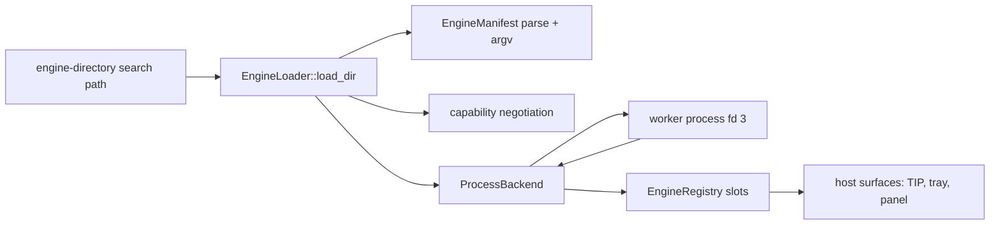

# Subsystem Architecture: Engine Runtime

- Status: Living Blueprint
- Last Updated: 2026-09-11
- Scope: core/engine — engine discovery, `typio-engine-*.toml` manifests, engine processes, the Typio Engine Protocol, and the engine install layout
- Maintainers: Typio maintainers

---

## 1. System Overview & Boundaries

The engine runtime turns an engine *package* — one manifest plus one worker
executable — into a live input-method backend without ever placing engine code
in the daemon's address space. Two crates split the work. `typio-runtime` is the
platform-neutral state machine: it owns configuration, input contexts, the
engine registry, language and mode selection, and the out-of-process process
backend. The daemon owns discovery: it resolves an ordered search path, scans it
for manifests, and registers each engine with the runtime through the registry's
native Rust API.

The single inbound contract is Typio Engine Protocol on a private file
descriptor; the only engine-supplied bytes the daemon ever sees are bounded
protocol frames. External clients reach this subsystem only through TIP, which
is a separate contract on a separate socket ([Control Plane and
Clients](control-and-clients.md)).

| Owned by this subsystem | Owned elsewhere |
|---|---|
| Manifest parsing and argv resolution (`typio-engine-manifest`) | Wayland session, focus, and input-method policy (`typio-daemon`) |
| The ordered engine search path and its scan | Panel rendering and presentation ([Panel Rendering](panel-rendering.md)) |
| Worker spawn, framing, handshake, request budgets | TIP verbs, framing, and client crates ([Control Plane and Clients](control-and-clients.md)) |
| The engine registry and the keyboard/voice slots | Desktop integration: SNI tray, notifications |
| Engine namespaces in the config schema | Release procedure ([Governance](../governance/index.md)) |

## 2. Invariants & Non-Negotiable Rules

- **`[INV-ENG-01]`** Engine code never enters the daemon address space. The host
  does not `dlopen` engines, does not link a shared engine library, and does not
  call engine vtables or callbacks; the only engine interface is Typio Engine
  Protocol on the private fd 3 channel.
- **`[INV-ENG-02]`** `typio-runtime` stays platform-neutral. It builds only an
  `rlib`, embedded by the daemon, and its dependency set is the engine protocol,
  TOML/serde, `libc`, `log`, and `nix`. It must not gain Wayland, GPU/renderer,
  D-Bus, or tracer types.
- **`[INV-ENG-03]`** The runtime owns no engine search path and no default engine
  directory. The host resolves the directory list and registers engines; the
  runtime retains the resolved list only to answer `engine.reload` rescans.
- **`[INV-ENG-04]`** No user-writable directory is auto-scanned. A command-line
  flag or an exported environment list is the only way to add a directory, and
  that line is the operator's recorded trust decision.
- **`[INV-ENG-05]`** Scanning is flat and non-recursive. A directory entry is a
  candidate only when its file name matches `typio-engine-*.toml`; the first
  registration of a name wins and later duplicates are skipped, never merged.
- **`[INV-ENG-06]`** A manifest loads only when `name`, `type`, and `command` are
  non-empty, `protocol` equals `typio-engine-protocol`, and every entry in
  `required` is a capability the host provides. Missing `optional` capabilities
  degrade the engine instead of rejecting it.
- **`[INV-ENG-07]`** Standard input is not a protocol channel. Standard output and
  standard error carry logs only, so engine diagnostics can never corrupt
  protocol traffic.
- **`[INV-ENG-08]`** Every frame is bounded (8 MiB payload) and carries a major
  and minor version. A major-version mismatch is a transport error. After
  malformed input, a request-id mismatch, or a broken channel the stream is
  discarded; neither peer attempts byte-stream resynchronisation or reuses a
  poisoned channel.
- **`[INV-ENG-09]`** Handshake identity must agree with the manifest. The host
  validates the `EngineHello` engine name and type against the manifest before
  registration, rejects schema keys outside the `engines.<engine-name>.`
  namespace, and applies the schema atomically.
- **`[INV-ENG-10]`** The host dictates runtime roots. `HostHello` carries the
  exact config, data, and state directories — including command-line overrides —
  and workers use them instead of reconstructing paths from ambient XDG
  variables.
- **`[INV-ENG-11]`** The retired ABI must not return. No C ABI, no `libtypio.so`,
  no installed engine headers, no pkg-config metadata, no vtables or factories,
  no `dlopen` of engines, no generic `typio-engine-worker` bridge, and no
  compatibility shim for ABI-era engines.

## 3. Component Architecture & Data Flow

### 3.1 Runtime crate (`typio-runtime`)

| Coordinate | Responsibility |
|---|---|
| `crates/typio-runtime/src/core/registry/mod.rs` | `EngineRegistry`: orthogonal keyboard/voice slots, activation and cycling, language resolution, mode caching, command dispatch, language declarations, idle-worker reaping |
| `crates/typio-runtime/src/core/engine/backend/process.rs` | `ProcessBackend`: spawn, fd 3 framing, handshake, per-request deadlines, poisoning and asynchronous respawn, voice request handle |
| `crates/typio-runtime/src/core/engine/backend/engine_protocol.rs` | Re-export of the workspace `typio-engine-protocol` types consumed by the backend |
| `crates/typio-runtime/src/config_schema.rs` | Unified config schema; engine schema registration via the hello path |
| `crates/typio-runtime/src/instance.rs` | `TypioInstance`: owned runtime state, the host-supplied engine directory list, and the init path |
| `crates/typio-runtime/src/voice/` | Voice session, audio plumbing, and types as owned values |

Registry and configuration mutation stay on the main loop; audio and inference
hand off owned `Arc` handles. A keyboard and a voice engine are simultaneously
active — they are two slots, not alternatives.

### 3.2 Discovery search path (host-owned)

`crates/typio-daemon/src/engine_loader/dirs.rs` resolves the search path in a
fixed precedence; `crates/typio-daemon/src/app/mod.rs` scans each resolved
directory at startup with `EngineLoader::load_dir`.

| Order | Source | Path |
|---|---|---|
| 1 | `-E` / `--engine-dir DIR` | Directories given on the command line; repeatable; scanned in the order given |
| 2 | `$TYPIO_ENGINE_PATH` | Colon-separated directory list; scanned in listed order |
| 3 | System engine dir | Compile-time `<prefix>/<datadir>/typio/engines` (default `/usr/local/share/typio/engines`) |

Empty flag values and empty environment segments are skipped. The system
directory is appended last and never removed. There is no user or `$HOME`
auto-scan. The daemon passes the resolved directories to
`TypioInstance::new_rust`, and `ipc_bus` uses them for `engine.reload` manifest
resolution through `find_manifest_for` (which looks for
`typio-engine-<name>.toml` in order and takes the first hit).

The compile-time system directory is a *build-time* knob
(`TYPIO_ENGINE_DIR=… cargo build`), not a runtime environment variable.

### 3.3 Manifest contract

`typio-engine-manifest` is the shared typed contract for
`crates/typio-daemon`'s loader and `typio-engine-check`.

| Key | Required | Value |
|---|---:|---|
| `name` | Yes | Engine identifier used by config, the CLI, and `typioctl` |
| `type` | Yes | `keyboard` or `voice` |
| `protocol` | Yes | `typio-engine-protocol` |
| `command` | Yes | Worker executable; a value containing `/` resolves relative to the manifest file |
| `args` | No | Argument array; values containing `/` resolve relative to the manifest file |
| `arg` | No | Single-argument form, placed before `args` |
| `display_name`, `description`, `author`, `icon` | No | Display metadata; `icon` is a freedesktop icon name |
| `language` | No | Legacy single BCP 47 tag |
| `languages` | No | Ordered BCP 47 array, primary first; wins over `language`; defaults to `und` |
| `required` | No | Capabilities the host must provide |
| `optional` | No | Capabilities the host may provide |

Loading a single manifest is a fixed sequence in
`crates/typio-daemon/src/engine_loader/mod.rs`: parse, check required fields,
check the protocol value, map `type` to an engine kind, negotiate capabilities,
build the argv, construct a `ProcessBackend`, register it, and finally forward
`languages` through `EngineRegistry::set_engine_languages`. A rejected manifest
is skipped with a reason and never aborts the directory scan.

The host advertises the keyboard capability set (`preedit`, `candidates`,
`prediction`, `punctuation`, `learning`) and, for voice builds, adds
`voice_input` and `continuous_voice`
(`crates/typio-daemon/src/engine_loader/caps.rs`).

### 3.4 Worker process model

`ProcessBackend` spawns one executable per engine package
(`launch_worker` in `crates/typio-runtime/src/core/engine/backend/process.rs`):

- The host creates a `UnixStream::pair()`, keeps the host end non-blocking, and
  duplicates the engine end onto **fd 3** in the child's `pre_exec` hook.
- The child environment receives `TYPIO_ENGINE_PROTOCOL=1.0` and
  `TYPIO_ENGINE_FD=3`.
- Standard input is redirected to `/dev/null`; standard output and standard
  error are inherited so the worker contributes diagnostics to the daemon's log
  stream.
- Spawn retries cover the transient `ETXTBSY` window that a package upgrade
  creates (ten attempts, 10 ms apart).
- A schema probe or a failed handshake kills and reaps the child explicitly, so
  discovery cannot leak workers.

Frames come from `typio-engine-protocol`:

| Item | Value |
|---|---|
| Magic | `TYEP` (network byte order), constants in `crates/typio-engine-protocol/src/frame.rs` |
| Version | major `1`, minor `0` |
| Header fields | magic, major, minor, message type, flags, request id, payload length |
| Message types | `EngineHello`, `HostHello`, `Request`, `Response`, `Event`, `Error` |
| Maximum payload | 8 MiB |
| Protocol fd | `3` |

Payload encoding, message types, and the request catalog are specified in the
[Engine Protocol Reference](../reference/engine-protocol.md); the typed codec is
the only Rust contract and no Rust layout or `repr(C)` crosses the boundary.

A transport or decode error poisons the worker. The backend discards it and
starts a fresh process asynchronously; while the respawn is in flight the
backend reports no engine so keyboard keys fall through to the application
instead of blocking the caller on a multi-second spawn. Recovery failures back
off exponentially (`2^(N-1)` seconds, capped at 64 seconds by
`RECOVERY_BACKOFF_MAX_EXP = 6` — roughly one attempt per minute) so a
permanently broken engine cannot become a spawn storm. The
registry additionally reaps workers that sat idle past a caller-supplied
threshold; the daemon's event loop drives this with a fixed 15-minute idle
threshold (`IDLE_REAP_AFTER` in `crates/typio-daemon/src/app/event_loop.rs`).

### 3.5 Handshake and request budgets

1. The worker sends `EngineHello` (request id 0) immediately: protocol, engine
   name, type, and zero or more `SCHEMA` records. It must not perform heavy
   initialization yet.
2. A **discovery probe** starts the executable, validates the hello, registers
   the complete schema atomically, and closes the worker without sending
   `HostHello`. Workers must tolerate the host closing the channel here.
3. An **activation** repeats `EngineHello`, receives `HostHello` with the
   host-owned config, data, and state roots, and only then initializes its own
   implementation state.
4. Requests and responses are one-to-one transactions; every response echoes the
   request id.

Deadlines are derived from the request in `request_timeout_for`
(`crates/typio-runtime/src/core/engine/backend/process.rs`):

| Operation | Budget |
|---|---|
| `EngineHello` / `HostHello` handshake | 5 seconds |
| `init` | 60 seconds |
| `reload-config`, `invoke-command` | 5 seconds |
| `process-audio` | 120 seconds |
| `process-key` | 50 milliseconds |
| `availability` | 100 milliseconds |
| All other requests | 500 milliseconds |

### 3.6 Runtime-mutable engine capabilities

Language declarations are layered ([ADR-0034](../adr/0034-dynamic-engine-capabilities.md)):

- **L1 — static manifest (active).** The `languages` array is registered at load
  time and is the floor that holds before a worker reports anything.
- **L2 — runtime self-report (API present, no worker path).** 
  `EngineRegistry::set_engine_languages` is callable any number of times and
  replaces the declared set; the daemon's state controller rebuilds derived
  surfaces on `notify_languages_changed`. The typed protocol defines no message
  by which a worker triggers this, so today only the loader (L1) calls it. Do
  not describe worker-driven language reporting as working.
- **L3 — user override.** Deferred; the wiring point is a further
  `set_engine_languages` call.

### 3.7 Install layout

| Artifact | Location |
|---|---|
| Worker executable | `<prefix>/<libexecdir>/typio/engines/` |
| Manifest | `<prefix>/<datadir>/typio/engines/` |
| Engine icons | `<prefix>/<datadir>/icons/hicolor/...` |

Workers are private helpers, not user commands, so they do not live in
`bindir` and are never found through `PATH`. Installed manifests carry an
absolute `command`; development manifests generated in build trees may use
`./typio-engine-*` so `--engine-dir build` works without installation. A
scanned engine directory that contains an `icons/` subdirectory has that
directory published to the tray as `IconThemePath`.

### 3.8 Conformance gate

`typio-engine-check` is the black-box gate at the real process boundary. It
reads the same `typio-engine-*.toml` as the daemon, launches the declared
executable with a private fd 3 channel, and never loads engine code itself.

| Dimension | Coverage |
|---|---|
| Protocol | required manifest fields, protocol and type, spawn, `EngineHello`, identity, schema namespace, `HostHello` |
| Behavior | initialization, availability, one keyboard or voice request, clean shutdown |
| Resource | freedesktop icon name, asset presence and placement |

It shares `typio-engine-manifest` and `typio-engine-protocol` with the daemon,
so frame limits and payload decoding are identical to production; it supplies
isolated temporary config, data, and state roots and removes them afterwards.
Only `FAIL` exits non-zero; `WARN` flags legal but suspicious behavior such as a
keyboard declining a plain printable key. Engine-specific correctness still
belongs in each engine's own test suite. Run it against every package in CI, and
against `crates/typio-engine-protocol/examples/typio-engine-hello.toml` for
protocol work.

### 3.9 Retired mechanisms

These must not be reintroduced; they describe the pre-[ADR-0046](../adr/0046-engine-protocol-only-runtime.md)
architecture:

- The C engine ABI, its vtables, factories, and callback user data.
- `libtypio.so` and its version script, installed engine headers under
  `typio/abi/*`, and ABI pkg-config metadata.
- `dlopen` of engines and any in-process engine adapter in the daemon.
- The generic `typio-engine-worker` bridge that loaded an engine `.so` inside a
  helper, and the `.engine` / `worker-v2` / `typio-engine-ipc` manifest
  spellings.
- The single-valued `TYPIO_ENGINE_DIR` runtime variable and the symlink
  workaround it forced.
- Compatibility shims, aliases, or adapters for ABI-era engine packages. Engine
  packages migrate to self-contained protocol workers; the daemon deliberately
  provides no bridge.

## 4. Historical Lineage & Founding ADRs

Compaction Date: none — no record has been compacted into this blueprint yet.

| Record | Established | Status |
|---|---|---|
| [Framework ADR-0015: IPC-Only Engine Backend](../adr/archive/framework-core/adr/0015-ipc-only-engine-backend.md) | A single engine registration path backed by a worker process; the daemon stops adapting C vtables in-process | Superseded by framework ADR-0017 |
| [Framework ADR-0017: Typio Engine Protocol and engine-process registration](../adr/archive/framework-core/adr/0017-typio-engine-protocol.md) | The protocol name, the private fd 3 transport, `TYPIO_ENGINE_PROTOCOL`/`TYPIO_ENGINE_FD`, bounded versioned frames, logs off stdio, and the `protocol = "typio-engine-protocol"` manifest value | Accepted; amended by root ADR-0046 |
| [ADR-0025](../adr/0025-engine-discovery-search-path.md) | The ordered engine search path, the repeatable `--engine-dir`, the colon-separated environment list replacing the single-valued variable, and no user-level auto-scan | Accepted |
| [ADR-0026](../adr/0026-modality-explicit-engine-control-surface.md) | Keyboard and voice as orthogonal, simultaneously active slots; modality-explicit control verbs with cross-modality `engine.*` aggregates | Accepted |
| [ADR-0027](../adr/0027-ipc-engine-manifests.md) | Manifest-declared engines instead of shared-library filenames; the daemon stops `dlopen`ing engines | Superseded by ADR-0030 |
| [ADR-0028](../adr/0028-direct-ipc-engine-workers.md) | One direct worker executable per engine package; the generic ABI bridge is withdrawn | Superseded by ADR-0030 |
| [ADR-0029](../adr/0029-engine-package-install-layout.md) | Workers in `libexecdir`, manifests in `datadir`, icons in the freedesktop hicolor theme | Accepted; terminology amended by ADR-0030 |
| [ADR-0030](../adr/0030-engine-process-manifests.md) | The `typio-engine-*.toml` schema, `command`/`args` argv resolution, the required protocol value, and stdout/stderr reserved for logs | Accepted; manifest keys extended by ADR-0031 |
| [ADR-0031](../adr/0031-language-first-switching-surface.md) | The `languages` manifest key and the language-first switch unit this subsystem feeds | Accepted |
| [ADR-0034](../adr/0034-dynamic-engine-capabilities.md) | Language declarations as runtime data: static floor, runtime replacement, deferred user override | Accepted; the worker-side trigger is still unwired |
| [ADR-0046](../adr/0046-engine-protocol-only-runtime.md) | Typio Engine Protocol as the only engine boundary; `typio-runtime` as an internal `rlib`; removal of the C ABI, headers, pkg-config, vtables, and `typio-abi` | Accepted; supersedes ADR-0038's ABI workspace decision |

The compaction triggers and the tombstone procedure live in the [Living
Snapshot entity](../governance/documentation/profiles/architecture/living-snapshot.md);
the registry status of every record is tracked in the [ADR
Index](../adr/index.md).

## See Also

- [Engine Protocol Reference](../reference/engine-protocol.md) — frames, message types, and the request catalog
- [Engine Discovery Reference](../reference/engine-discovery.md) — search path, manifest keys, timeouts, capabilities
- [Engine contract](../explanation/engine-contract.md) — lifecycle and ownership rationale
- [Engine-to-host resource flow](../explanation/engine-host-resource-flow.md) — which channel carries which resource
- [`typio-runtime`](../../crates/typio-runtime/README.md), [`typio-engine-protocol`](../../crates/typio-engine-protocol/README.md), [`typio-engine-check`](../../crates/typio-engine-check/README.md) — crate contracts
- [Workspace Topology](workspace-topology.md) — crate ownership and dependency direction
