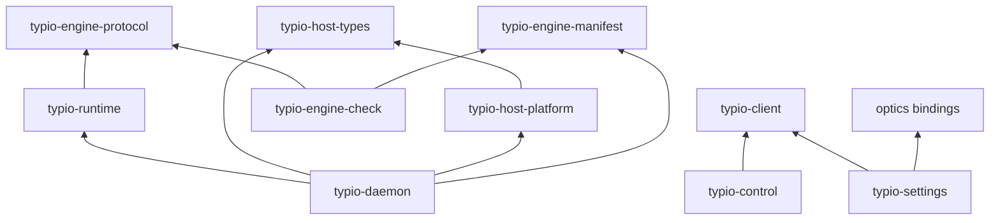

# Subsystem Architecture: Workspace Topology

- Status: Living Blueprint
- Last Updated: 2026-09-11
- Scope: core/workspace — Cargo workspace membership, crate responsibilities, dependency direction, the Optics pin, CI topology, and the release version source
- Maintainers: Typio maintainers

---

## 1. System Overview & Boundaries

The Typio repository is one virtual Cargo workspace. It holds the Wayland
daemon, the platform adapter, the platform-neutral runtime, the engine contract
crates, the shared TIP client, the command-line client, the graphical settings
application, and a task helper. Every crate that describes how an engine is
packaged, launched, or validated lives here, so a contract change and its
consumers land in one commit.

Two things deliberately stay outside: **engine packages** (each engine is its
own repository with its own dependency stack and release cadence) and the
**`optics` graphics stack** (shared with non-Typio projects). Both enter this
workspace through a contract rather than a source copy — engines through Typio
Engine Protocol, optics through tagged Cargo sources plus native libraries
discovered on the build host.

| Owned by this subsystem | Owned elsewhere |
|---|---|
| Workspace membership and inter-crate dependency direction | Engine package repositories |
| The pinned Optics dependency graph and local patch mode | `optics` sources, its Meson build, and its native libraries |
| CI job topology and the build matrix's environment variables | Release procedure ([Governance](../governance/index.md)) |
| Which crate produces which installed binary | Packaging and install layout ([Engine Runtime](engine-runtime.md)) |

## 2. Invariants & Non-Negotiable Rules

- **`[INV-WKS-01]`** One virtual workspace root. Members are declared only in the
  root `Cargo.toml`, and workspace-wide commands (`cargo fmt -- --check`,
  `cargo clippy --workspace --all-targets`, `cargo test --workspace`) run from
  that root.
- **`[INV-WKS-02]`** Dependency direction is layered. `typio-runtime` must not
  depend on Wayland, D-Bus, or GPU/renderer types; `typio-host-types` stays
  platform-neutral; the protocol crates depend on nothing in this workspace.
- **`[INV-WKS-03]`** Engines are reached only through Typio Engine Protocol. No
  crate links a shared engine library, and no crate exists to carry a C ABI
  across the engine boundary.
- **`[INV-WKS-04]`** Clients reach the daemon only through TIP, and only through
  the shared `typio-client` crate. A client must not link runtime or daemon code
  to obtain state.
- **`[INV-WKS-05]`** The runtime is embedded, not installed: `typio-runtime`
  builds an `rlib` and the daemon binary is `typio`.
- **`[INV-WKS-06]`** Optics Rust bindings come from tagged Git sources. Native
  Optics libraries come from a Meson build tree or an installed prefix found via
  environment variables or `pkg-config`; no Optics source is vendored here.
- **`[INV-WKS-07]`** Local cross-repository mode is a linked worktree, not a
  committed change: it activates through `.cargo/config.toml` copied from
  `.cargo/optics-local.toml`, and neither that file nor the local `Cargo.lock`
  may be committed while its `[patch]` table is active.
- **`[INV-WKS-08]`** The daemon package is the single version source for
  releases. Do not add a second version source.
- **`[INV-WKS-09]`** Engine packages and `optics` remain separate repositories.
  Only the retired ABI crate and the separate client repositories were folded
  into this workspace.

## 3. Component Architecture & Data Flow

### 3.1 Workspace members

| Crate | Produced binary | Responsibility |
|---|---|---|
| `crates/typio-daemon` | `typio` | Wayland input-method daemon: session and focus handling, keyboard policy, candidate panel driving, tray surface, voice plumbing, and the TIP UDS server |
| `crates/typio-host-platform` | — | Wayland and Flux platform integration: surfaces, input, SHM presentation, text rasterisation |
| `crates/typio-host-types` | — | Platform-neutral host state and policy types shared by the daemon and the platform layer |
| `crates/typio-runtime` | — | Headless input-method state machine and engine-scheduling runtime; built as an `rlib` and embedded by the daemon |
| `crates/typio-client` | — | Shared Rust client for TIP: framing, request/response calls, event subscriptions |
| `crates/typio-control` | `typioctl` | Command-line control client; maps resource-and-verb commands onto TIP RPCs |
| `crates/typio-engine-protocol` | — | Typed wire contract for engine processes, including the versioned fd 3 frame codec |
| `crates/typio-engine-manifest` | — | Typed contract for `typio-engine-*.toml` manifests |
| `crates/typio-engine-check` | `typio-engine-check` | Black-box conformance and validation tool for manifest-declared engine processes |
| `crates/typio-settings` | `typio-settings` | Graphical settings application |
| `crates/xtask` | — | Cargo task helper: `cargo xtask install` and `cargo xtask uninstall` |

`crates/typio-host-platform` declares `links = "typio_host_platform"`, so it can
appear at most once in a dependency graph. Per-crate module coordinates are
maintained in the [Module Map](../dev/module-map.md).

### 3.2 Dependency direction



| Rule | Enforcement |
|---|---|
| The runtime is platform-neutral | `typio-runtime` depends on `typio-engine-protocol`, TOML/serde, `libc`, `log`, and `nix` — no Wayland, Flux, Iris, or Lens crate appears in its manifest |
| Host policy types are shareable | `typio-host-types` depends only on `bitflags` and `tracing` |
| The protocol is the engine boundary | `typio-engine-protocol` has no workspace dependencies; the daemon, the manifest crate, and the conformance tool all consume it, and an engine worker may not link `typio-runtime` |
| Clients are TIP-only | `typio-client` depends on `serde_json` alone; `typio-control` depends on `typio-client`, `clap`, and `serde_json`; `typio-settings` depends on `typio-client` plus the Optics bindings |
| The platform layer never owns policy | `typio-host-platform` depends on `typio-host-types`, not on `typio-runtime` |
| Engine discovery is host-owned | The daemon's loader crate registers engines into the runtime through its public registry API; the runtime carries no search path |

The daemon binary wires the two halves: it owns the Wayland/Flux platform layer
and the TIP server, embeds the runtime as an `rlib`, and exposes runtime state to
clients only over TIP.

### 3.3 How Optics is consumed

| Concern | Canonical (primary worktree) | Local cross-repository worktree |
|---|---|---|
| Rust bindings | Tagged Optics Git sources in `[workspace.dependencies]` | Sibling `../optics` paths through a Cargo `[patch]` table |
| Native libraries | `pkg-config` or the local Meson build tree | Sibling `../optics/build-release` |
| `Cargo.lock` | Remote Git commits; tracked in Git | Local path dependencies; ignored by the commit hook |
| Cargo configuration | Default, or `.cargo/config.example.toml` | `.cargo/config.toml` copied from `.cargo/optics-local.toml` |

The workspace pins `flux-sys`, `flux-text-sys`, `iris`, `iris-sys`, and
`lens-sys` to a tagged Optics release (tag `v0.0.44` in `[workspace.dependencies]`
at the time of writing). The native `libflux` and its text backend
have no Cargo-native build yet, so contributors compile the sibling Optics tree
with Meson and point the `-sys` build scripts at it:

```bash
meson setup ../optics/build -Dtext=true --buildtype=debugoptimized
meson compile -C ../optics/build
export FLUX_BUILD_DIR="$PWD/../optics/build"
export FLUX_SOURCE_DIR="$PWD/../optics/libs/flux"
```

`FLUX_BUILD_DIR` selects the in-tree library and the build script bakes an
`-Wl,-rpath` into the binaries, so neither a system install nor an
`LD_LIBRARY_PATH` entry is required in the development loop. The Iris and Lens
bindings resolve through `IRIS_BUILD_DIR`, `IRIS_SOURCE_DIR`, `LENS_BUILD_DIR`,
and `LENS_SOURCE_DIR`. Linking directly to the Meson tree is the supported
development path; an installed prefix works when `FLUX_BUILD_DIR` is unset. CI
builds Optics against an uninstalled prefix and therefore sets
`LD_LIBRARY_PATH` explicitly.

Local cross-repository mode is a **linked Git worktree**: the primary worktree
stays on `main` with the canonical graph, while a long-lived `dev` worktree
resolves live sibling Optics sources. Activating it means copying
`.cargo/optics-local.toml` to `.cargo/config.toml` and installing the repository
hooks with `git config core.hooksPath .githooks`. The hook refuses to commit a
`Cargo.lock` that reflects local paths, and refuses a release-shaped version bump
while local mode is active. Promoting an Optics release — bumping the tags,
moving `OPTICS_PINNED_REF` in the CI workflow, and regenerating the canonical
lockfile — is specified in [Typio and Optics Cross-Repository
Development](../dev/optics-dev-worktree.md); the product release process
itself belongs to [Governance](../governance/index.md).

### 3.4 CI topology

`.github/workflows/ci.yml` defines one workflow, triggered by a push to `main`,
any pull request, or manual dispatch, with in-progress runs cancelled when a
newer run starts for the same ref.

| Job | Gates |
|---|---|
| Check, Format, and Lint | `cargo fmt -- --check`; `cargo clippy --workspace --all-targets -- -D warnings` |
| Cargo build & test | `cargo build --workspace`; `cargo test --workspace` with the Optics build tree on the library path |
| RustSec audit | `cargo audit` over the locked dependency graph |
| Valgrind leak gate (FFI render paths) | Builds the daemon and host-platform test binaries, then runs Valgrind with definite-leak detection over the `icon_badge`, `text_raster`, and `panel::` test filters, using `tools/valgrind-leak-gate.supp` |

Three jobs install the system toolchain and clone Optics at the pinned commit
recorded in the workflow's `OPTICS_PINNED_REF` environment variable, then build
it with Meson before running Cargo. No job carries an `if` condition, so all four
are evaluated for a pull request and any failing job fails the run. The
documentation gate is defined separately as Gate C in
[Governance](../governance/index.md), which runs
`tools/check-docs.sh`.

### 3.5 Version source

The daemon package (`crates/typio-daemon/Cargo.toml`) is the single version
source; the release commit bumps it, updates `Cargo.lock`, and moves the
changelog's unreleased block. The bump policy and the annotated-tag convention
are in [Governance](../governance/index.md), which this blueprint links rather
than restates.

### 3.6 Retired build and layout decisions

- **The C ABI boundary.** No crate carries an engine ABI across a dynamic-library
  boundary, and no host C ABI is published for embedders.
- **The `typio-abi` crate.** It existed only to hold the shared representation of
  the retired C ABI and is not a workspace member.
- **Separate sibling repositories for the CLI and settings.** Both are workspace
  members, so protocol changes to them land atomically with the daemon.
- **The bilingual C/Rust build.** This repository ships no `meson.build`; the
  daemon and clients build with Cargo, and the only Meson build in the developer
  loop is the sibling Optics tree that provides `libflux`.

## 4. Historical Lineage & Founding ADRs

Compaction Date: none — no record has been compacted into this blueprint yet.

| Record | Established | Status |
|---|---|---|
| [ADR-0035](../adr/0035-bilingual-migration-to-rust.md) | The host moves to Rust with bilingual coexistence, local XML protocol codegen, and sibling-checkout dependencies during the migration | Accepted; its "no monorepo" commitment (D5) is superseded for settings by ADR-0045 |
| [ADR-0038](../adr/0038-framework-abi-vet-monorepo.md) | Framework, ABI, and conformance tooling move into the Cargo workspace so contract changes land atomically | Superseded by ADR-0046 |
| [ADR-0039](../adr/0039-cli-workspace-integration.md) | The CLI becomes a workspace member; the settings panel and engine repositories stay external | Accepted; client duplication and settings deferral superseded by ADR-0045 |
| [ADR-0045](../adr/0045-rust-settings-workspace-integration.md) | The settings application joins the workspace as a Rust member, and `typio-client` becomes the single shared TIP implementation | Accepted |
| [ADR-0046](../adr/0046-engine-protocol-only-runtime.md) | The ABI boundary is removed from the workspace; the runtime becomes an internal `rlib`; the engine boundary is the protocol crate | Accepted |
| [ADR-0051](../adr/0051-single-documentation-tree.md) | One documentation tree at the repository root; the per-crate trees of the former independent repositories are retired | Accepted |

The compaction triggers and tombstone procedure live in the [Living Snapshot
entity](../governance/documentation/profiles/architecture/living-snapshot.md);
record status is tracked in the [ADR Index](../adr/index.md).

## See Also

- [Module Map](../dev/module-map.md) — per-crate source coordinates
- [Developer Setup](../dev/setup.md) — prerequisites, feature flags, and build commands
- [Optics Development Worktree Workflow](../dev/optics-dev-worktree.md) — worktree setup, dependency modes, and pin promotion
- [Interface Stability Reference](../reference/stability.md) — the tier of each externally consumable interface
- [Engine Runtime](engine-runtime.md) and [Control Plane and Clients](control-and-clients.md) — the subsystems these crates implement
