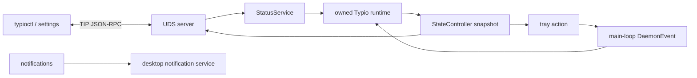
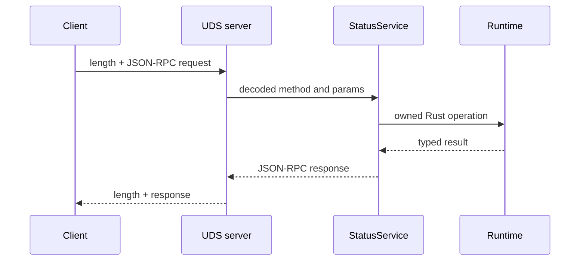

# Control surfaces

Typio has one external control transport and two in-process presentation
surfaces. Runtime policy has one owner regardless of where an action begins.

| Surface | Transport | Role |
|---|---|---|
| TIP | credential-checked Unix socket, length-prefixed JSON-RPC | external query, mutation, and subscriptions |
| System tray | SNI/dbusmenu over the session bus | in-process presentation and user actions |
| Notifications | `org.freedesktop.Notifications` | one-way health output |

There is no D-Bus control API. D-Bus is used only for desktop integration.
There is also no engine control socket exposed to clients: fd 3 belongs to one
private daemon/engine relationship and carries Typio Engine Protocol, not TIP.

## TIP request flow

`StatusService` is transport-agnostic and testable through `ServiceBackend`.
The production backend borrows the main-loop-owned `TypioInstance`; it does not
hold raw pointers. UDS framing, method dispatch, and runtime policy remain
separate modules.

Clients subscribe with `events.subscribe`. Registry, language, mode, and config
changes refresh a `StateController` snapshot; the IPC bus sends notifications
to subscribed peers and the tray refreshes from the same state. Peer UID checks,
the 1 MiB frame cap, and connection limits are enforced before dispatch.

## Tray actions

Tray callbacks never mutate the registry from the D-Bus worker. They enqueue a
typed `DaemonEvent::TrayAction`; the main event loop applies the language,
engine, restart, or quit operation and then refreshes all state surfaces. This
keeps `Rc<RefCell<_>>` runtime ownership single-threaded.

## Failure rule

External clients must tolerate the daemon being absent, reconnect after socket
replacement, negotiate `protocolVersion` with `hello`, and re-read state after
subscribing. A client cache is a view, never a second source of truth.

See the [TIP reference](../reference/ipc-protocol.md) for methods and framing.
